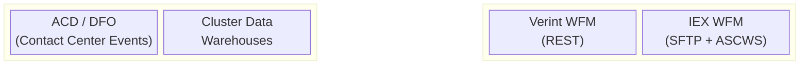
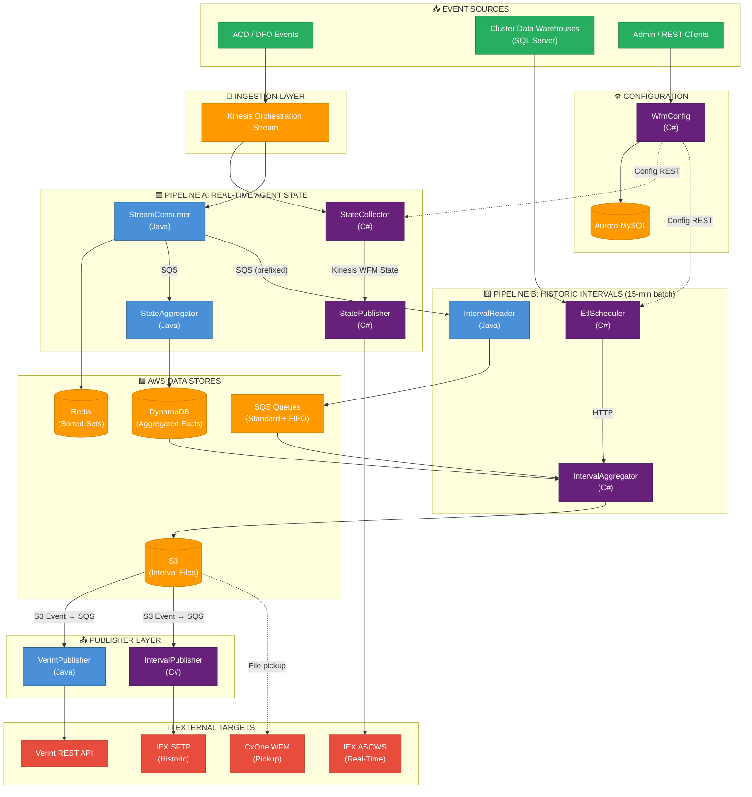

# WFM Integration Platform — Simple Block Diagram

A high-level block diagram showing the two main pipelines, core services, and data stores.

---

## Block Diagram

---

## Simplified Architecture (Flowchart)

---

## Legend

| Color | Meaning |
|-------|---------|
| 🟣 Purple | C# services (.NET 6+) |
| 🔵 Blue | Java services (Spring Boot 3.x) |
| 🟠 Orange | AWS managed services |
| 🔴 Red | External target systems |
| 🟢 Green | Event sources |

---

## Key Takeaways

1. **Two Pipelines**: The platform has a **real-time** streaming pipeline (per-event, Kinesis-driven) and a **historic batch** pipeline (15-min intervals, file-based via S3).

2. **Polyglot**: Java handles high-throughput stream processing (StreamConsumer, StateAggregator, IntervalReader, VerintPublisher). C# handles orchestration, configuration, and file generation.

3. **Event-Driven**: Services communicate via Kinesis streams, SQS queues, and S3 event notifications — minimal direct HTTP coupling.

4. **Multi-Tenant**: All services are multi-tenant; events carry `tenantId`. Publisher services route to per-tenant external endpoints.

5. **Multi-Region**: Deployed on ECS Fargate across 4 regions (NA2, NA3, UK2, ZA1) via Jenkins CI/CD.
