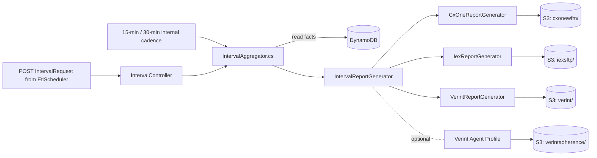

# Module: integrations-wfm-aggregator (IntervalAggregator)

## Architecture Overview

IntervalAggregator is the **historic-interval file generator**. It reads aggregated facts from **DynamoDB** (written by StateAggregator and the upstream Kinesis aggregation), groups them into 15-minute (and optionally 30-minute) windows, and writes per-tenant files to **S3** in distinct prefixes per WFM target type. Downstream services (`VerintPublisher`, `IntervalPublisher`) consume those files.

This service does NOT publish to "Queue Reports" / "Agent Reports" SQS — that abstraction does not exist. The handoff to downstream services is **S3 file drop**, optionally with S3-event SQS notification.

### Tech stack

- C# / .NET (ASP.NET Core hosted)
- Dapper / AWS SDK for DynamoDB reads
- AWS S3 for output
- 71KB `IntervalAggregator.cs` orchestrator
- Three report generators under `ExternalModels/`

### Entry points

```
integrations-wfm-aggregator/wfm-intervalaggregator/
├── Program.cs                          — host bootstrap
├── Startup.cs                          — DI: DynamoConnector, DynamoReader, AwsS3Publisher (line 198-206)
├── IntervalAggregator.cs               — 71KB core engine (15-min loop at ~line 172, 30-min branch at ~line 349)
├── ApiManager.cs                       — API identity + build info
└── ExternalModels/
    ├── CxOneWfm/CxOneReportGenerator.cs
    ├── IEX/IexReportGenerator.cs
    └── Verint/VerintReportGenerator.cs
```

### Request lifecycle



### External dependencies

- **DynamoDB** — primary input (aggregated facts written by StateAggregator)
- **S3** — output bucket `IntegrationsWFMIntervalBucket` with per-target prefixes
- **EtlScheduler** — HTTP `POST /api/v1/Interval/cluster` and `/ETLErrorInterval` triggers
- **Internal SQS** — used only for inter-aggregator orchestration, NOT for output
- **CloudWatch** — metrics + logs

---

## Core Components

### REST endpoints (called by EtlScheduler)

```
POST /api/v1/Interval/cluster
Body: IntervalRequest { Cluster, ClusterNumber, StartDateUTC, EndDateUTC, Interval=15 }

POST /api/v1/Interval/cluster/ETLErrorInterval
Body: ErrorIntervalRequest { ...IntervalRequest, StatusReason }
```

### DynamoDB reader

| Class | Role |
|-------|------|
| `IDynamoConnector` / `DynamoConnector` | Low-level DynamoDB client wrapper (Startup.cs line 198) |
| `IDynamoReader` / `DynamoReader` | Higher-level read API (line 199) |
| `DynamoReportAggregator` | Calls `GetReportIntervalsForDynamoTenant()` (used at IntervalAggregator.cs line 1029) |

### Three report generators (`ExternalModels/`)

| Generator | File extension | Output S3 prefix | Trigger |
|-----------|---------------|------------------|---------|
| `CxOneReportGenerator` | JSON | `cxonewfm/{BusinessUnit}_{TenantId}/` | Per CxOne-enabled tenant |
| `IexReportGenerator` | XML | `iexsftp/{Stack}/{Tenant}/` | Per IEX-enabled tenant |
| `VerintReportGenerator` | JSON | `verint/{BusinessUnit}_{TenantId}/` | Per Verint-enabled tenant |
| Verint Agent Profile | JSON | `verintadherence/{BusinessUnit}_{TenantId}/` | When agent-adherence feature enabled (filename also `yyMMdd.HHmm.json`) |

All invoked from `IntervalReportGenerator.cs` (line 36-50).

### `AwsS3Publisher` (Startup.cs line 206)

Writes the generated files to S3 with filename conventions:

| Generator | Filename format | Code reference |
|-----------|----------------|----------------|
| CxOne | `yyMMdd.HHmm.json` | `AwsS3Publisher.cs` line 138 |
| IEX | `MMddyy.HHmm.xml` | `AwsS3Publisher.cs` line 147 |
| Verint | `yyMMdd.HHmm.json` | `AwsS3Publisher.cs` line 152 |
| Verint Agent | `yyMMdd.HHmm.json` (typically `TTI_*.json` per tests) | `AwsS3Publisher.cs` line 153 |

See `AwsS3Publisher.cs` for routing + naming logic (CxOne prefix at line 138, IEX at line 147, Verint at line 152, Verint Agent at line 153).

### Cadence

- **15 min** — primary loop (`IntervalAggregator.cs` line 172)
- **30 min** — additional reports when `EndDateUTC.Minute % 30 == 0` (line 349)
- Whether a given tenant gets 15-min vs 30-min comes from tenant config (DynamoDB + Aurora)

### Invariants

- DynamoDB is the **single source** for facts; IntervalAggregator does not subscribe to Kinesis directly
- One file per (tenant, interval-window, report-type) — never overwrites mid-flight
- Per-tenant enablement determines which generators fire (CxOne-only tenant skips Verint generator)
- S3 PutObject triggers downstream via S3 event notification → SQS (`SqsVerintPublishQueue`, `SqsPublishQueue`)

---

## Service Interactions

### Inbound

| Source | Mechanism |
|--------|-----------|
| EtlScheduler | HTTP `POST /api/v1/Interval/cluster` |
| Internal cadence | 15/30-min loop in `IntervalAggregator.cs` |
| StreamConsumer-driven path | Aggregation context shared via DynamoDB facts |

### Outbound

| Target | Mechanism | Consumer |
|--------|-----------|----------|
| S3 `cxonewfm/{BU}_{TenantId}/*.json` | `AwsS3Publisher` | external CxOne process |
| S3 `iexsftp/{Stack}/{Tenant}/*.xml` | `AwsS3Publisher` | `IntervalPublisher` (SFTP push) |
| S3 `verint/{BU}_{TenantId}/*.json` | `AwsS3Publisher` | `VerintPublisher` (via SqsVerintPublishQueue) |
| S3 `verintadherence/{BU}_{TenantId}/*.json` | `AwsS3Publisher` | `VerintPublisher` (agent profile / TTI files) |
| CloudWatch | metrics + logs | SRE |

### Auth & error

- AWS: ECS task role for DynamoDB read + S3 write
- DynamoDB throttling: SDK retry
- S3 PutObject failure: logged + retried; persistent failure surfaces as metric

---

## Data Models

### Input — DynamoDB aggregated rows

Written by StateAggregator. Schema is the contract between StateAggregator (writer) and DynamoReportAggregator (reader). Keys typically `<tenantId>#<entityType>` partition + time-window sort.

### Output file structure

**Verint queue file** (`verint/{BU}_{TenantId}/yyMMdd.HHmm.json`) — array of skill-level interval metrics.

**Verint agent file** (`verintadherence/{BU}_{TenantId}/TTI_yyyyMMdd.HHmm.json`) — `TTI_` prefix marks agent-time-tracking rows consumed by `AgentPerformanceService` in VerintPublisher.

**IEX file** (`iexsftp/{Stack}/{Tenant}/MMddyy.HHmm.xml`) — XML format consumed by IntervalPublisher → SFTP'd to IEX.

**CxOne file** (`cxonewfm/{BU}_{TenantId}/yyMMdd.HHmm.json`) — JSON consumed by external CxOne process (no consumer service exists in this repo).

### Config sources

- DynamoDB tenant config — enable/disable per generator per tenant
- Aurora `wfm_config` table — base URL / connection details consumed downstream

---

## Conventions & Patterns

### File layout

```
wfm-intervalaggregator/
├── Program.cs, Startup.cs, ApiManager.cs
├── IntervalAggregator.cs                # 71KB main engine
├── Controllers/                         # REST entry from EtlScheduler
├── DataAccess/                          # DynamoConnector, DynamoReader, DataWarehouseConnector
├── Aggregation/                         # DynamoReportAggregator, ReportDataCollector, helpers
├── ExternalModels/
│   ├── CxOneWfm/CxOneReportGenerator.cs
│   ├── IEX/IexReportGenerator.cs
│   └── Verint/VerintReportGenerator.cs
├── Publisher/AwsS3Publisher.cs          # S3 file writer
├── Monitoring/                          # health, metrics
└── appsettings.json
```

### Tests

`wfm-intervalaggregator.xunit_tests/` — focused suites:

- `CxOneReportGeneratorTests`, `IEXReportGeneratorTests`, `VerintReportGeneratorTests`
- `AwsS3PublisherTests`
- `IntervalAggregatorTests`, `IntervalAggregator30MinTests`
- `CxOneSpecificTests`, `CxOneSpecific30MinTests`
- `TenantLimiterTests`, `TenantLimiterTests30MinTest`
- `AggregationTests/` (DataAggregator, ReportTypeHelper, etc.)

---

## Configuration

```bash
# S3 output
IntegrationsWFMIntervalBucket    # bucket name (appsettings.json line 18)

# DynamoDB
NICEWFM_DYNAMODB_TABLE_NAME      # aggregated-fact table
NICEWFM_REGION                   # AWS region

# Cadence (tenant-driven via DynamoDB/Aurora)
NICEWFM_INTERVAL_SIZE_MINUTES    # 15 (also generates 30 when EndDateUTC.Minute % 30 == 0)
```

`appsettings.json` line 18 sets the bucket name; per-tenant enablement is data-driven.

---

## Common Tasks

### Verify a tenant's reports are generating

1. Check DynamoDB has aggregated rows for the tenant + interval window.
2. Check the corresponding S3 prefix for the file:
   ```
   aws s3 ls s3://<IntegrationsWFMIntervalBucket>/verint/<BU>_<TenantId>/
   ```
3. Look for `yyMMdd.HHmm.json` (Verint/CxOne) or `MMddyy.HHmm.xml` (IEX).

### Add a new WFM target generator

1. Add `ExternalModels/<Target>/<Target>ReportGenerator.cs`.
2. Add the dispatch branch in `IntervalReportGenerator.cs`.
3. Add S3 prefix + filename pattern in `AwsS3Publisher.cs`.
4. Add tenant-enablement field in config.
5. Add a downstream consumer service (mirror of VerintPublisher / IntervalPublisher).
6. Add xUnit tests under `wfm-intervalaggregator.xunit_tests/`.

### Diagnose missing files in S3

1. Was the EtlScheduler POST received? Check CloudWatch logs for the `Cluster` + `EndDateUTC`.
2. Did DynamoDB return rows? Look for `DynamoReportAggregator` log entries.
3. Did the generator run? Look for `<Target>ReportGenerator` log entries.
4. Did `AwsS3Publisher.Publish` succeed? Look for S3 PutObject success / failure.

### Reprocess a window manually

Use the catch-up mechanism in `wfm-etlscheduler` (`Interval_UpdateLastEtlRequest` rollback). Don't manipulate files directly in S3 — downstream consumers will get duplicates.

---

## Troubleshooting

| Symptom | Diagnosis |
|---------|-----------|
| No files in `verint/` for a tenant | Tenant not Verint-enabled in DynamoDB tenant config, or no facts in DynamoDB for the window |
| Wrong file extension | Routing bug in `AwsS3Publisher.cs` — confirm generator → prefix mapping |
| Files generated but downstream not picking up | S3 event → SQS bridge missing or DLQ filling |
| Aggregation hot path slow | 71KB engine is CPU-bound — profile + check DynamoDB Query latency |
| Wrong values in file | Generator-specific formula bug — search for the DTO type in `IntervalAggregator.cs` |

---

## Reference Files

- `wfm-intervalaggregator/IntervalAggregator.cs` (71KB)
- `wfm-intervalaggregator/Startup.cs` — DI wiring
- `wfm-intervalaggregator/ExternalModels/CxOneWfm/CxOneReportGenerator.cs`
- `wfm-intervalaggregator/ExternalModels/IEX/IexReportGenerator.cs`
- `wfm-intervalaggregator/ExternalModels/Verint/VerintReportGenerator.cs`
- `wfm-intervalaggregator/Publisher/AwsS3Publisher.cs` (lines 136-185 for routing)
- `wfm-intervalaggregator/DataAccess/DynamoConnector.cs`, `DynamoReader.cs`
- `wfm-intervalaggregator/appsettings.json` (line 18 = bucket)
- `wfm-intervalaggregator.xunit_tests/` — comprehensive test suite

### Related skills

- `wfm-verintpublisher` — direct downstream for the `verint/` and `verintadherence/` prefixes
- `wfm-intervalpublisher` — direct downstream for the `iexsftp/` prefix (and would handle `cxonewfm/` if a publisher existed)
- `wfm-stateaggregator` — populates the DynamoDB facts this service reads
- `wfm-etlscheduler` — HTTP-triggers the per-cluster aggregation
- `wfm-execution-flow` — Flow 2 historic-file pipeline
- `wfm-dependency-mapping` — S3 bucket + prefix ownership
- `wfm-observability` — log group + metrics
