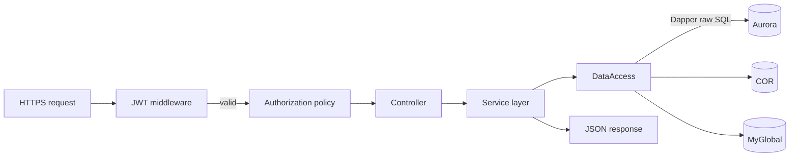

# Module: WfmConfig

## Architecture Overview

WfmConfig is the **single source of truth** for runtime configuration in the WFM Integration Platform — tenant enablement, cluster definitions, shard assignments, adherence rules, and feature flags. It is the only service that writes to Aurora, COR, and MyGlobal via REST CRUD endpoints, protected by JWT Bearer auth. All other services read this configuration on startup and/or periodically.

### Tech stack

- C# / ASP.NET Core (.NET Core 6+)
- Dapper ORM (raw SQL, no LINQ/EF queries)
- JWT Bearer authentication (custom signature validation)
- Prometheus.DotNet (`/metrics`)
- Swashbuckle / Swagger
- Built via **dotnet CLI** (`dotnet build` + `dotnet publish`, Dockerfile lines 37-38; build image `mcr.microsoft.com/dotnet/sdk:6.0`). NOT Gradle.

### Entry points

```
WfmConfig/Program.cs    — host builder
WfmConfig/Startup.cs    — DI, middleware, Dapper type mappers, Prometheus
```

### Request lifecycle



### External dependencies

- **Aurora MySQL** — primary WFM config (tenants, clusters, settings, adherence)
- **COR (MySQL)** — customer organization records, divisions/BUs
- **MyGlobal (MySQL)** — multi-tenant global lookups
- **AWS Secrets Manager** — DB creds + encryption key
- **S3** — TLS certs

---

## Core Components

### Controllers (per feature area)

Actual controllers under `WfmConfig/Controllers/`:

| Controller | Purpose |
|-----------|---------|
| `ConfigController` | Configuration CRUD (v1) |
| `ConfigV2Controller` | Configuration CRUD (v2, versioned API) |
| `TenantController` | Tenant CRUD |
| `BusinessUnitController` | Business unit CRUD (v1) |
| `BusinessUnitV2Controller` | Business unit CRUD (v2) |
| `ExternalWfmConfigController` | External WFM target configuration |

Read each controller for its `[Route(...)]` attribute and action verbs — they do not all map 1:1 to the table-prefix patterns the database module uses (`TenantStatus_*`, `Clusters_*`, etc.).

### Service layer

`Services/<Entity>Service.cs` — business logic and validation. Encapsulates Dapper calls so controllers stay thin.

### DataAccess layer

Each entity has a `<Entity>Repository.cs` calling stored procedures via Dapper:

```csharp
// Example pattern (substitute the actual procedure name from StoredProcedures/)
var result = await _connection.QueryAsync<TenantStatusDto>(
    "TenantStatus_Upsert",                       // verify procedure name before use
    new { TenantId = tenantId, /* ... */ },
    commandType: CommandType.StoredProcedure);
```

### `Startup.cs` highlights

- Registers Dapper custom type mappers for all DTOs (set at startup, applies globally)
- Configures JWT Bearer with custom signature validation (relaxed in dev)
- Adds authorization policies (claims/roles per endpoint)
- Adds CORS (allow-all by default; tighten per environment)
- Mounts Prometheus middleware on `/metrics`
- Adds Swagger at `/swagger`

### Invariants

- All SQL is raw strings against stored procedures — **no LINQ queries**
- Every DTO has a registered Dapper type handler in `Startup.cs`
- JWT signature validation is relaxed in dev — in prod it must be strict
- Aurora is the only database with stored procedures; COR and MyGlobal use direct queries or shared procedures

---

## Service Interactions

### Inbound

- HTTPS REST calls from admins (UI) and from all other services (config fetch on startup)

### Outbound

- **Aurora / COR / MyGlobal** — Dapper-mediated SQL
- **Secrets Manager** — credential fetch at startup
- **S3** — TLS cert fetch at startup
- **CloudWatch** — logs (log group `integrations-wfm-config`)
- **Prometheus** — `/metrics` endpoint scraped by internal monitoring

### Auth

- Inbound: JWT Bearer token, custom signature validation
- Outbound to DBs: connection credentials from Secrets Manager
- AWS: ECS task role `Role-integrations-ecs-service`

### Error & retry

- Database transient failures: rely on Dapper/connection pool retry
- Bad JWT: 401 immediately
- Authorization failure: 403

---

## Data Models

### `SegmentedByDivisions` feature (recent: INT-56278, INT-56303)

- Referenced in DTOs (`TenantStatusDto` registered at `Startup.cs` line 107) and `DataAccess/DatabaseConnector.cs`
- **Underlying Aurora table column** (`tbl_409_tenant_status.sql` lines 1-20): single integer `division_id` — NOT separate `SegmentedByDivisions` boolean + `DivisionIdSet` array columns. Set semantics in the API layer are constructed application-side; verify the actual schema before SQL changes.

### Tables / procedures consumed

WfmConfig calls Aurora stored procedures via Dapper. The verified stored-procedure inventory is in `wfm-database` — exact procedure names live in `integrations-wfm-database/StoredProcedures/`. Examples actually present: `TenantStatus_Insert`, `TenantStatus_Update`, `TenantStatus_Upsert` (not the `_Get/_Put/_GetAll` set previously claimed in older versions of this doc).

### Encryption-in-transit modes

`ENCRYPTION_IN_TRANSIT_MODE`: `http` | `https` | `dual`. Affects Kestrel binding and listener config.

---

## Conventions & Patterns

### File layout

```
WfmConfig/
├── Program.cs
├── Startup.cs                       # DI, middleware, Dapper, JWT, Prometheus
├── Controllers/                     # one per feature
├── Services/                        # business logic
├── DataAccess/                      # Dapper repositories
├── Models/                          # DTOs (matched to Dapper type handlers)
├── Dapper/                          # custom type mappers
├── Auth/                            # JWT validation + policies
├── Prometheus/                      # metric helpers
└── appsettings.{Env}.json
```

### Naming

- Controllers: `<Entity>Controller`
- Services: `<Entity>Service`
- Repositories: `<Entity>Repository`
- DTOs: `<Entity>Dto`, `<Entity>Request`, `<Entity>Response`

### Testing

- `WfmConfig.XunitTests/` — xUnit tests, Dapper mocked or in-memory

### Logging

- Structured JSON to stdout → CloudWatch `integrations-wfm-config`
- Per-request fields via ASP.NET Core middleware

### Config management

- No `appsettings.json` present in `WfmConfig/` root (verified via filesystem search). Config flows via `IConfiguration` from env vars / deployment config.
- All secrets and per-env values via environment variables (ECS task definition)

---

## Configuration

### Environment variables

```bash
# Secrets Manager
AuroraSecret             # default: integrations-wfm-aurora-db
CorSecret                # default: integrations-wfm-cor-db
MyGlobalSecret           # default: integrations-wfm-myglobal-db
NiCEncryptionKeySecret   # default: integrations-ic-encryption-key

# ASP.NET
ASPNETCORE_URLS          # e.g., https://+:443
ENCRYPTION_IN_TRANSIT_MODE   # http | https | dual

# FIPS
ENABLE_FIPS              # true|false
AWS_USE_FIPS_ENDPOINT    # true|false

# TLS certs (S3)
SERVER_CERTIFICATE_URI
SERVER_CERTIFICATE_KEY_URI
```

### ECS task definition

`boot/wfm-config-Service-task.json` — 256 MB, ports 80/443, log group `integrations-wfm-config`.

---

## Common Tasks

### Add a new configuration endpoint

1. Add stored procedure(s) to `integrations-wfm-database/StoredProcedures/`.
2. Add DTO in `Models/` and register a Dapper type handler in `Startup.cs`.
3. Add `<Entity>Repository.cs` with `QueryAsync` calling the procedure.
4. Add `<Entity>Service.cs` with business logic.
5. Add `<Entity>Controller.cs` with REST endpoints + authorization policy.
6. Add Swagger annotations.
7. Update `WfmConfig.XunitTests/` with controller + service tests.

### Update `SegmentedByDivisions` for a tenant

```http
PUT /api/tenantStatus
{
  "TenantId": "...",
  "SegmentedByDivisions": true,
  "DivisionIdSet": ["div-1", "div-2"]
}
```

Aurora `TenantStatus_Put` is invoked; consumers pick up on next refresh.

### Rotate a database secret

1. Update value in AWS Secrets Manager (`integrations-wfm-aurora-db`, etc.).
2. Restart ECS task — Startup re-reads on boot. (WfmConfig does not auto-rotate; for hot rotate, see EtlScheduler's pattern.)

### Tighten JWT validation for prod

Find the relaxed validator in `Startup.cs` under JWT Bearer config — replace the no-op signature check with the real validator for non-dev environments.

---

## Troubleshooting

| Symptom | Diagnosis |
|---------|-----------|
| 401 Unauthorized | JWT invalid/expired or signature relaxation off in non-dev |
| DB connection failures | Secrets Manager value malformed, ECS subnet/SG can't reach DB, RDS unavailable |
| Slow queries | Stored procedure inefficient — `SHOW CREATE PROCEDURE` to inspect |
| `SegmentedByDivisions` not taking effect | TenantStatus row not updated, or downstream services not refreshing config |
| Prometheus `/metrics` returning 404 | Middleware not registered in `Startup.cs` |

---

## Reference Files

- `WfmConfig/Program.cs`
- `WfmConfig/Startup.cs`
- `WfmConfig/Controllers/*Controller.cs`
- `WfmConfig/Services/*Service.cs`
- `WfmConfig/DataAccess/*Repository.cs`
- `WfmConfig/Models/`
- ECS task definition for actual env-var mappings (no `appsettings.json` in repo root)
- `WfmConfig/Dockerfile`
- `boot/wfm-config-Service-task.json`
- `WfmConfig.XunitTests/`

### Related skills

- `wfm-database` — stored procedures and Aurora schema
- `wfm-dependency-mapping` — secrets + ownership
- `wfm-system-architecture` — role in the platform
- `wfm-observability` — log group + Prometheus
- Any module skill — consumers of this config
