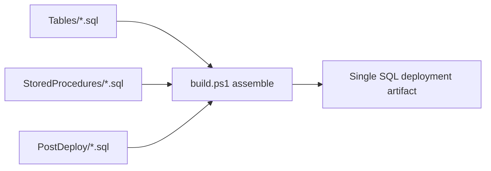

# Module: integrations-wfm-database

## Architecture Overview

This module is the **single repository of Aurora MySQL schema** for the WFM Integration Platform — table DDL, stored procedures, and post-deployment data scripts. A PowerShell `build.ps1` assembles them into a single deployable artifact in the correct order. Application services (WfmConfig, EtlScheduler, VerintPublisher, IntervalPublisher) consume the schema via Dapper raw-SQL calls; there is **no migrations framework**.

### Storage

- **Engine**: MySQL / Amazon Aurora (MySQL-compatible)
- **Access**: Dapper from C# services / JDBC from Java services
- **Secrets**: connection creds from AWS Secrets Manager `integrations-wfm-aurora-db`
- **Network**: VPC-internal only

### Build artifact



Verified order (`build.ps1` line 42): `$ORDER = @("Tables", "StoredProcedures", "PostDeploy")`.

### Versioning

`$FULLVERSION = "$version-git-$COMMITHASH"` (`build.ps1` line 38). Example shape: `22.1.4-git-5c807f2f`.

---

## Core Components — Verified Inventory

> **Important.** Previous versions of this skill listed table names like `TenantStatus`, `wfm_config`, `SftpConnectionData` directly. The actual files use a `tbl_<number>_<name>.sql` naming convention. Read the file list before referencing a table by name.

### Tables (`integrations-wfm-database/Tables/`)

Verified files include:

- `tbl_409_tenant_status.sql` — tenant status table; contains a single `division_id INT` column (NOT separate `SegmentedByDivisions` boolean + `DivisionIdSet` array)
- `tbl_409_iex_config.sql` — IEX configuration table; contains:
  - `iex_acd_id`, `nice_wfm_configuration_name`, `kms_key_identifier`
  - `iex_server_root`, `iex_internal_root`, `iex_username`, `iex_encoded_password`
  - `iex_stack`, `iex_product_id`
  - `sftp_host`, `sftp_port`, `sftp_target_path`, `sftp_user_name`, `sftp_password`
  - `ascws_host`, `ascws_client_id`, `ascws_client_secret`
  - `active`
- Additional `tbl_408_*`, `tbl_409_*`, `tbl_410_*`, `tbl_440_*`, `tbl_441_*` files (run `ls Tables/` for the current list)

The `tbl_409_iex_config` table is the **one source** for both IEX REST (ASCWS) credentials and IEX SFTP credentials — there is no separate `SftpConnectionData` table. SFTP creds are accessed via stored procedure `Interval_GetSftpConnectionsByTenantStack` (called by IntervalPublisher's `DatabaseConnector.cs` line 180); the procedure body abstracts the table layout.

### Stored procedures (`integrations-wfm-database/StoredProcedures/`)

Verified procedures:

**TenantStatus** (called by WfmConfig):
- `TenantStatus_Insert.sql`
- `TenantStatus_Update.sql`
- `TenantStatus_Upsert.sql`

**Interval / ETL** (called by EtlScheduler):
- `Interval_GetClusters.sql` — returns ClusterInfo rows
- `Interval_GetLastEtlRequest.sql` — idempotency lookup
- `Interval_UpdateLastEtlRequest.sql` — mark interval processed

**Interval / SFTP** (called by IntervalPublisher):
- `Interval_GetSftpConnectionsByTenantStack.sql` — returns `SftpConnectionData` DTO (data sourced from `tbl_409_iex_config`)

**Tenant external config** (called by VerintPublisher):
- `External_GetAllTenantData.sql` — returns rows mapped to `TenantConfigRelation` → `TenantData` (called by `AuroraDbService.java` line 56)

Run `ls integrations-wfm-database/StoredProcedures/` for the full list. Do not assume `<Entity>_Get`, `<Entity>_Put`, or `<Entity>_GetAll` exist — only the names above are verified.

### Post-deploy (`integrations-wfm-database/PostDeploy/`)

Idempotent data-seeding scripts run after Tables + StoredProcedures.

---

## Service Interactions

### Consumer / procedure mapping

| Caller | Procedures invoked |
|--------|---------------------|
| **WfmConfig** | `TenantStatus_Insert`, `TenantStatus_Update`, `TenantStatus_Upsert`, plus other entity procedures under `StoredProcedures/` (read the dir for the full list) |
| **EtlScheduler** | `Interval_GetClusters`, `Interval_GetLastEtlRequest`, `Interval_UpdateLastEtlRequest` |
| **VerintPublisher** | `External_GetAllTenantData` |
| **IntervalPublisher** | `Interval_GetSftpConnectionsByTenantStack` |

### Sister databases

WfmConfig also reads from two other MySQL databases not owned by this module:

- **COR** — Customer Organization Records, divisions/BUs
- **MyGlobal** — multi-tenant global lookups

Those schemas live elsewhere.

---

## Data Models

### Verified column shape

```sql
-- tbl_409_tenant_status.sql (single division_id column)
-- contains tenant identifiers + active flag + division_id INT
-- (read the file directly for the full DDL)
```

```sql
-- tbl_409_iex_config.sql (combined IEX REST + SFTP)
-- iex_*: REST / ASCWS settings (iex_server_root, iex_username, iex_encoded_password, iex_product_id, iex_stack)
-- sftp_*: SFTP settings (sftp_host, sftp_port, sftp_target_path, sftp_user_name, sftp_password)
-- ascws_*: ASCWS auth (ascws_host, ascws_client_id, ascws_client_secret)
-- active: enable flag
```

`SftpConnectionData` is a **DTO** name (in IntervalPublisher), not a database table name. It is populated from `Interval_GetSftpConnectionsByTenantStack`'s result set.

`TenantData` / `TenantConfigRelation` (in VerintPublisher) are likewise DTO names populated by `External_GetAllTenantData`.

### Dapper usage pattern

```csharp
var result = await connection.QueryAsync<TenantStatusDto>(
    "TenantStatus_Upsert",                     // confirm exact procedure name in StoredProcedures/
    new { TenantId = tenantId, /* ... */ },
    commandType: CommandType.StoredProcedure);
```

---

## Conventions & Patterns

### File layout

```
integrations-wfm-database/
├── Tables/                         # tbl_<id>_<name>.sql with CREATE TABLE IF NOT EXISTS
├── StoredProcedures/               # DROP PROCEDURE IF EXISTS + DELIMITER $$
├── PostDeploy/                     # idempotent data scripts
└── build.ps1                       # PowerShell assembler (order: Tables → StoredProcedures → PostDeploy)
```

### Stored-procedure template

```sql
DROP PROCEDURE IF EXISTS <Name>;
DELIMITER $$
CREATE PROCEDURE <Name>(<params>)
BEGIN
    -- SQL body
END$$
DELIMITER ;
```

### Naming

- Tables: `tbl_<id>_<descriptor>` (e.g., `tbl_409_iex_config`, `tbl_409_tenant_status`)
- Procedures: `<Entity>_<Operation>` (e.g., `TenantStatus_Upsert`, `Interval_GetClusters`)
- DTOs (in app code): `<Name>Dto`, `<Name>Data`, `<Name>Relation` — these do NOT need to match table names

### Versioning & deploy

- Version format `[YY].[MAJOR].[CU]-git-[HASH]` (build.ps1 line 38)
- Jenkins pipeline `integrations-wfm-database` applies the artifact
- Schema changes ship **before** application deployments that depend on them

---

## Configuration

### Connection details

Consumers read connection info from Secrets Manager secret `integrations-wfm-aurora-db`:

```json
{
  "username": "...",
  "password": "...",
  "hostReader": "...",
  "hostWriter": "...",
  "port": 3306
}
```

EtlScheduler's `DatabaseManager` auto-reloads on auth failure. WfmConfig restart required for credential rotation.

---

## Common Tasks

### Add a new column

1. Edit the target `Tables/tbl_<id>_<name>.sql` — add `ALTER TABLE ... ADD COLUMN IF NOT EXISTS` (idempotent).
2. Update any `StoredProcedures/*.sql` that read/write the column.
3. Update consumer DTOs + Dapper mappers.
4. Run `build.ps1` to verify artifact assembly.
5. Deploy DB before deploying dependent application service.

### Add a new stored procedure

1. Create `StoredProcedures/<Name>.sql` with `DROP PROCEDURE IF EXISTS` + `DELIMITER $$` block.
2. Add the consumer call in the appropriate service.
3. Test against a dev Aurora instance before merging.

### Backfill / data fix

1. Write an idempotent script into `PostDeploy/`.
2. Test on dev first.
3. Document any one-shot semantics in script comments.

### Reset an EtlScheduler interval marker

```sql
CALL Interval_UpdateLastEtlRequest('<cluster_id>', 'COMPOSITE_ETL', '<earlier_ts>');
```

EtlScheduler catch-up logic will issue fresh POSTs on next tick — may cause duplicate IntervalAggregator runs.

---

## Troubleshooting

| Symptom | Diagnosis |
|---------|-----------|
| Consumer can't connect | Verify Secrets Manager + Aurora endpoint + VPC SGs |
| Procedure returns wrong shape | Check deployed version: `SHOW CREATE PROCEDURE <name>` vs. file |
| Migration didn't apply | Check Jenkins pipeline last run; rerun if needed |
| Dapper DTO mismatch errors | Column names from SP `SELECT` aliases don't match DTO property attributes |
| Missing table reference in skill docs | Check `ls Tables/` for the actual `tbl_<id>_<name>.sql` filename before assuming a table name |

---

## Reference Files

- `integrations-wfm-database/Tables/` — all `tbl_<id>_<name>.sql`
- `integrations-wfm-database/StoredProcedures/` — all `<Name>.sql`
- `integrations-wfm-database/PostDeploy/` — idempotent scripts
- `integrations-wfm-database/build.ps1` — assembler (line 38 versioning, line 42 order)
- `integrations-wfm-database/StoredProcedures/Interval_GetClusters.sql`
- `integrations-wfm-database/StoredProcedures/Interval_GetLastEtlRequest.sql`
- `integrations-wfm-database/StoredProcedures/Interval_UpdateLastEtlRequest.sql`
- `integrations-wfm-database/StoredProcedures/Interval_GetSftpConnectionsByTenantStack.sql`
- `integrations-wfm-database/StoredProcedures/External_GetAllTenantData.sql`
- `integrations-wfm-database/StoredProcedures/TenantStatus_Insert.sql` / `_Update.sql` / `_Upsert.sql`
- `integrations-wfm-database/Tables/tbl_409_iex_config.sql`
- `integrations-wfm-database/Tables/tbl_409_tenant_status.sql`

### Related skills

- `wfm-config` — main consumer of TenantStatus + other procedures
- `wfm-etlscheduler` — uses `Interval_*` procedures
- `wfm-verintpublisher` — uses `External_GetAllTenantData`
- `wfm-intervalpublisher` — uses `Interval_GetSftpConnectionsByTenantStack` for IEX SFTP creds
- `wfm-system-architecture` — platform-wide context
