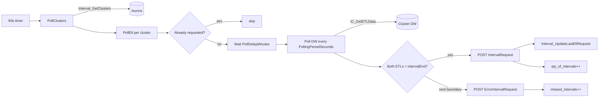

# Module: integrations-wfm-etlscheduler

## Architecture Overview

EtlScheduler is the **C# time-triggered orchestrator** that bridges per-cluster Data Warehouse ETL pipelines and the WFM IntervalAggregator. Every 60 seconds it iterates over all clusters from Aurora, computes the current 15-min interval boundary, polls each cluster's SQL Server DW for two ETL completion timestamps, and HTTP-POSTs an `IntervalRequest` to IntervalAggregator when both ETLs cross the boundary. On restart, catch-up logic backfills any missed intervals.

**What the POST triggers downstream:** IntervalAggregator (C#) reads DynamoDB aggregated facts and writes per-tenant **interval files to S3** (`verint/`, `verintadherence/`, `iexsftp/`, `cxonewfm/` prefixes). It does NOT publish to "Queue Reports" or "Agent Reports" SQS — that pattern doesn't exist. The S3 PutObject events then drive the three downstream publishers (VerintPublisher via `SqsVerintPublishQueue`, IntervalPublisher via `SqsPublishQueue`).

### Tech stack

- C# / .NET 6 (Amazon Linux 2023 base image)
- ASP.NET Core (probe endpoints + DI host)
- `IHostedService` background pattern
- Dapper ORM (Aurora MySQL + SQL Server)
- Prometheus.DotNet + CloudWatch (dual metrics sinks)

### Entry points

```
WfmEtlScheduler/
├── Program.cs                  — FIPS / encryption bootstrap → WebHostHelper.RunWebHost
├── Startup.cs                  — DI: ApiManager, HealthMonitor, MetricService, DatabaseConnector
├── EtlScheduler.cs             — IHostedService: core polling/orchestration loop
└── ApiManager.cs               — API identity, build info, instance UUID, JWT signing key
```

`WebHostHelper.BuildWebHostWithInMemoryS3Certificate` downloads HTTPS certs from S3, registers `EtlScheduler` as `IHostedService`, and starts Kestrel on 80/443 (35049/35050 in DEBUG).

### Request lifecycle



### External dependencies

- **Aurora MySQL** — `Interval_GetClusters`, `Interval_GetLastEtlRequest`, `Interval_UpdateLastEtlRequest`
- **Per-cluster SQL Server DW** — `IC_GetETLData(etlName)`
- **IntervalAggregator REST** — `POST /api/v1/Interval/cluster` and `/ETLErrorInterval`
- **AWS Secrets Manager** — Aurora + DW credentials
- **S3** — TLS certs
- **CloudWatch + Prometheus** — telemetry

---

## Core Components

### `EtlScheduler.cs` (the heart)

```csharp
public class EtlScheduler : IHostedService {
    public Task StartAsync(CancellationToken ct);   // starts 60s timer
    private async Task PollClusters();              // each tick
    private async Task PollEtl(ClusterInfo c);      // per cluster, fire-and-forget
}
```

Key 15-min math (`UtilityClasses/ExtensionMethods.cs`):

```csharp
DateTime.This15MinIncrement()   // floor to current quarter-hour (1:12 → 1:00)
DateTime.Next15MinIncrement()   // ceil to next quarter-hour    (1:12 → 1:15)
```

Per-cluster algorithm:

```
intervalEnd = now.This15MinIncrement()
if LastSuccessfulIntervalRequest >= intervalEnd → skip

wait PollDelayMinutes after the boundary

loop every PollingPeriodSeconds:
  if IC_GetETLData(DW_SUMMARIZE_AGENT_LOG) > intervalEnd
     and IC_GetETLData(DW_SUMMARIZE_CONTACT_LOG) > intervalEnd:
       POST IntervalRequest → success path
       break

  if now >= intervalEnd.Next15MinIncrement():
       POST ErrorIntervalRequest → timeout path
       break

catch-up: if lastSuccessful < (etlTime - 15min), backfill each gap
```

### `DatabaseConnector.cs` / `DatabaseManager.cs`

```csharp
public interface IDatabaseConnector {
    Task<List<ClusterInfo>> GetClusters();
    Task<DateTime> GetEtlUpdateTime(ClusterInfo c, string etlName);
    Task<DateTime> GetLastSuccessfulIntervalRequest(ClusterInfo c, string etlName);
    Task SetLastSuccessfulIntervalRequest(ClusterInfo c, string etlName, DateTime end);
}
```

- Dapper, `commandTimeout=120s`
- Catches `SqlException` (DW) / `MySqlException` (Aurora) with auth codes
- On auth failure: `DatabaseManager.LoadDatabaseConfigs()` re-fetches creds from Secrets Manager (hot rotate, no restart)

### `ApiManager.cs`

API identity + build info:

| Property | Use |
|----------|-----|
| `ApiName` | `"wfm-etlscheduler"` |
| `LatestApiVersion` | `"v1"` |
| `InstanceId` | UUID per pod (logged on every metric) |
| `BuildInfo` | Loaded from `BUILDINFO.json` at startup |
| `Started`, `Ready` | Booleans surfaced via `/probe/*` |
| `SIGNING_KEY` | Hardcoded JWT secret (for incoming token validation if used) |
| `ApiStats` | Concurrent dictionary for custom metrics |

Emits Prometheus counter `api_build_info{name,version,branch,commit,instance_id}` at init.

### `Controllers/ProbeController.cs`

No business endpoints — health/monitoring only:

| Endpoint | Returns |
|----------|---------|
| `GET /probe/healthcheck` | "OK" |
| `GET /probe/host` | hostname |
| `GET /probe/startup` | 200/500 based on `ApiManager.Started` |
| `GET /probe/ready` | 200/500 based on `ApiManager.Ready` |
| `GET /probe/healthreport` | placeholder |
| `GET /swagger` | Swagger UI |
| `GET /metrics` | Prometheus exposition |

### `Monitoring/`

- `HealthMonitor.cs` — facade fan-out to CloudWatch + Prometheus
- `PrometheusService.cs` — counters/gauges (see Observability section below)
- `AwsCloudWatch.cs` — CloudWatch publish every 60s, dimensions `instance-id` + `all=instances|clusters`
- `Logger.cs` — structured logger; error-level entries auto-increment `errors{type}` counter

### `S3/SSLCertificateS3Provider.cs`

Downloads cert + key PEMs from `SERVER_CERTIFICATE_URI` / `SERVER_CERTIFICATE_KEY_URI` (20s timeout), combines in-memory into PFX, loads with `MachineKeySet | Exportable` flags, hands to Kestrel for HTTPS.

### Invariants

- Only one outer timer tick at a time; per-cluster polls run concurrently as `Task.Run`
- `Interval_GetLastEtlRequest` is the **only** source of idempotency
- Both ETL names must complete before issuing a success POST (composite AND)
- Catch-up issues one POST per missed 15-min slot (no batching) to keep state correct

---

## Service Interactions

### Inbound

- No external callers — all incoming traffic is health/metric probes.

### Outbound

| Target | Mechanism | When |
|--------|-----------|------|
| Aurora | Dapper stored procedure | Every tick (cluster list) + per cluster (idempotency + write) |
| Cluster DW | Dapper stored procedure | Per `PollingPeriodSeconds` while waiting |
| IntervalAggregator REST | `HttpClient` POST | On success or timeout |
| Secrets Manager | AWS SDK | On startup + on auth-failure retry |
| S3 | AWS SDK | Startup only (TLS certs) |
| CloudWatch | AWS SDK | Every 60s |
| Prometheus | Inline HTTP exporter | Scraped externally |

### Error & retry

| Failure | Behavior |
|---------|----------|
| Aurora down | `cluster_count` stays 0; nothing polled; warning logged |
| DW down for a cluster | `poll-failures` per-cluster counter increments; service waits next tick |
| ETL didn't complete by next boundary | POST `ErrorIntervalRequest`; `missed_intervals{cluster}++` |
| IntervalAggregator down | `aggregator-send-failures (see PrometheusService.cs for exact label)++`; retried next tick |
| DB auth rejected | `DatabaseManager.LoadDatabaseConfigs()` re-reads Secrets Manager; query retried |

---

## Data Models

### DTOs (`DTO/`)

```csharp
class IntervalRequest {
    string   Cluster;          // cluster_id
    int      ClusterNumber;
    DateTime StartDateUTC;     // intervalEnd - 15min
    DateTime EndDateUTC;       // intervalEnd
    int      Interval = 15;
}
// POST → {AggregatorServiceHost}/api/v1/Interval/cluster

class ErrorIntervalRequest : IntervalRequest {
    string StatusReason;       // e.g., "Interval expired while polling"
}
// POST → {AggregatorServiceHost}/api/v1/Interval/cluster/ETLErrorInterval

class ClusterInfo {
    [Column(Name="cluster_id")]      string Id;
    [Column(Name="cluster_number")]  int    Number;
    [Column(Name="cluster_vip")]     string Vip;
    [Column(Name="dw_vip")]          string DWVip;       // NOTE: column is "dw_vip", not "cluster_dw_vip"
}

class DatabaseConfig {
    string Username, Password;
    string HostReader, HostWriter;   // Aurora read/write replicas
    string Host;                     // DW single host
    int    Port;
}
```

### Stored procedures used

| DB | Procedure | Purpose |
|----|-----------|---------|
| Aurora | `Interval_GetClusters` | List all clusters |
| Aurora | `Interval_GetLastEtlRequest(cluster_id, etl_name='COMPOSITE_ETL')` | Idempotency check |
| Aurora | `Interval_UpdateLastEtlRequest(cluster_id, etl_name, intervalEnd)` | Mark success |
| Cluster DW | `IC_GetETLData(etlName)` | Get last ETL completion time |

---

## Conventions & Patterns

### File layout

```
WfmEtlScheduler/
├── Program.cs
├── Startup.cs
├── EtlScheduler.cs                 # IHostedService loop
├── ApiManager.cs                   # identity + build info
├── Controllers/ProbeController.cs
├── DataAccess/
│   ├── IDatabaseConnector.cs
│   ├── DatabaseConnector.cs        # Aurora + DW queries
│   └── DatabaseManager.cs          # Secrets Manager integration
├── DTO/                            # IntervalRequest, ErrorIntervalRequest, ClusterInfo, DatabaseConfig
├── S3/SSLCertificateS3Provider.cs
├── Monitoring/                     # HealthMonitor, PrometheusService, AwsCloudWatch
├── UtilityClasses/
│   ├── Logger.cs
│   ├── ExtensionMethods.cs         # 15-min math
│   ├── WebHostHelper.cs
│   ├── CustomHttpClientFactory.cs
│   ├── HttpLoggingHandler.cs
│   └── DapperHelpers/
└── appsettings.{Env}.json
```

### Testing

`WfmEtlScheduler.XunitTests/` runs in the Dockerfile's `unittest` stage via Coverlet → `coverage.xml`.

### Logging

`Logger.cs` format: `{LogType} {ClientIp} {MethodName}: {Message}`. Error-level entries auto-increment matching `errors{type}` counter.

---

## Configuration

### Environment variables

```bash
# Secrets Manager
AuroraSecret              # default: integrations-wfm-aurora-db
DwSecret                  # default: integrations-wfm-cor-db

# Downstream
AggregatorServiceHost     # IntervalAggregator base URL (regional, internal)

# Scheduling
PollDelayMinutes          # default 1   (wait after 15-min boundary before polling DW)
PollingPeriodSeconds      # default 15  (recheck DW cadence)

# Networking + TLS
ASPNETCORE_URLS           # https://+:443
ENCRYPTION_IN_TRANSIT_MODE
SERVER_CERTIFICATE_URI
SERVER_CERTIFICATE_KEY_URI

# FIPS
ENABLE_FIPS
AWS_USE_FIPS_ENDPOINT
```

### appsettings.json

Minimal; defaults logging to `Warning`. `appsettings.Development.json` raises to `Debug`.

### ECS task

`boot/wfm-etlscheduler-Service-task.json` — 256 MB, bridge network, dynamic ports, log group `integrations-wfm-etlscheduler`.

---

## Observability

Prometheus `/metrics` — metric base names are defined in `Monitoring/StatLabels.cs` and registered in `Monitoring/PrometheusService.cs`. The Prometheus names below match what the code actually exposes (kebab-case in StatLabels becomes underscores in the Prometheus exposition — there is NO `etl_` prefix):

```
aggregation_requests                                   Counter
missed_intervals{cluster=...}                          Counter
qty_of_intervals{cluster=...}                          Counter
cluster_count                                          Gauge
api_build_info{name,version,branch,commit,instance_id} Counter
```

Additional counters / gauges exist for aggregation failures, aggregator send failures, poll failures, time-to-data, and categorized errors — read `PrometheusService.cs` for the exact label names before using them in alarms.

CloudWatch publish every 60s, dimensions `instance-id` and `all=instances|clusters`.

---

## Common Tasks

### Add a new required ETL

1. Add a new constant in `EtlScheduler.cs` (alongside `DW_SUMMARIZE_AGENT_LOG`).
2. Extend the wait loop to also check `IC_GetETLData(NEW_ETL_NAME) > intervalEnd`.
3. Confirm the cluster DW's `IC_GetETLData` stored procedure recognizes the new name.

### Force-reprocess a 15-min slot

```sql
CALL Interval_UpdateLastEtlRequest('<cluster_id>', 'COMPOSITE_ETL', '<earlier_timestamp>');
```

Catch-up will issue a fresh POST on the next 60s tick. Use sparingly — IntervalAggregator may receive duplicates.

### Verify the service is healthy after deploy

```bash
curl https://<host>/probe/ready       # should return 200
curl https://<host>/probe/startup     # should return 200
curl https://<host>/metrics | head    # should expose api_build_info{...} line
```

### Diagnose missed intervals

1. Check `missed_intervals{cluster=...}` is growing for a specific cluster.
2. Check that cluster's DW ETL job is actually completing within 15 min (DW side).
3. Check `poll-failures` per-cluster counter — if non-zero, DW connectivity issue.
4. Inspect CloudWatch logs for `IC_GetETLData` errors.

---

## Troubleshooting

| Symptom | Likely cause |
|---------|--------------|
| No POSTs sent | `cluster_count == 0` → Aurora returning no clusters, or Aurora unreachable |
| Specific cluster never advances | DW for that cluster always slower than 15 min, or DW unreachable |
| All clusters stuck | IntervalAggregator down (`aggregator-send-failures (see PrometheusService.cs for exact label)` rising) |
| Random "auth failed" then recovers | Credential rotation — auto-reload working as intended |
| Persistent auth failures | Secret format malformed or ECS role missing `secretsmanager:GetSecretValue` |
| Catch-up POSTs hammering Aggregator after restart | Expected if downtime > 15 min — backfill is sequential one POST per slot |

---

## Reference Files

- `integrations-wfm-etlscheduler/WfmEtlScheduler/EtlScheduler.cs`
- `WfmEtlScheduler/Startup.cs`, `Program.cs`, `ApiManager.cs`
- `WfmEtlScheduler/DataAccess/DatabaseConnector.cs`, `DatabaseManager.cs`
- `WfmEtlScheduler/DTO/*.cs`
- `WfmEtlScheduler/UtilityClasses/ExtensionMethods.cs`, `Logger.cs`
- `WfmEtlScheduler/Monitoring/PrometheusService.cs`, `AwsCloudWatch.cs`
- `WfmEtlScheduler/S3/SSLCertificateS3Provider.cs`
- `WfmEtlScheduler/Controllers/ProbeController.cs`
- `appsettings.json`
- `Dockerfile` (multi-stage)
- `boot/wfm-etlscheduler-Service-task.json`
- `WfmEtlScheduler.XunitTests/`
- `architecture/WFM-Scheduler-Component.puml`

### Related skills

- `wfm-aggregator` — direct downstream (receives `IntervalRequest` POSTs)
- `wfm-intervalreader` — parallel Java SQS-triggered path
- `wfm-database` — Aurora `Interval_*` stored procedures
- `wfm-execution-flow` — Flow 2A
- `wfm-observability` — telemetry + alarms
- `wfm-dependency-mapping` — secrets, IAM, contracts
- `wfm-system-architecture` — platform-wide context
