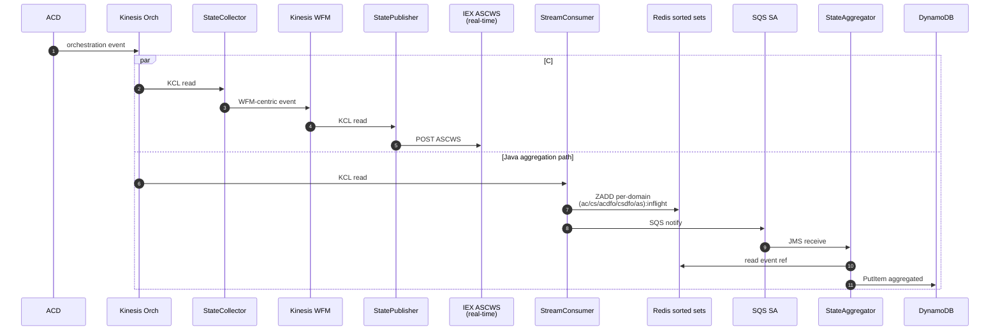
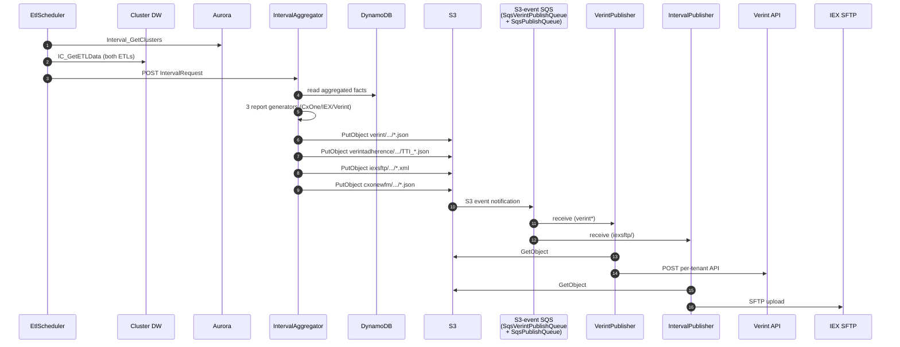

# WFM Integration Platform — Execution Flow

## Architecture Overview

The platform runs **two distinct pipelines** plus configuration management:

| Pipeline | Trigger | Output |
|----------|---------|--------|
| **A. Real-time agent state** | Per-event (Kinesis) | DynamoDB facts + IEX ASCWS REST |
| **B. Historic interval files** | 15 / 30 min cadence + DW ETL ready | S3 files → Verint REST / IEX SFTP / CxOne S3 |
| **C. Configuration** | Admin REST + periodic refresh | Aurora rows; consumed by all services |

The two data pipelines share **DynamoDB** as the boundary: Pipeline A writes it, Pipeline B reads it.

---

## Core Components — Flow 1: Real-Time Agent State

### Sequence

```
Step 1  ACD/DFO emits orchestration event
        └─> Kinesis Orchestration Stream (NICEWFM_STREAM_NAME)

Step 2  StateCollector (C#, IHostedService)
        ├─ KCL ShardReader → ConcurrentQueue cap=10,000
        ├─ N=NumberOfReadingProcessors threads drain queue
        ├─ OrchestrationParser.cs   → deserialize raw event
        ├─ OrchestrationEventProcessor.cs → transform WFM-centric
        └─> Kinesis WFM State Stream

Step 3  StreamConsumer (Java) ALSO reads same Kinesis Orchestration Stream
        Record processors route by event type:
          AgentSessionRecordProcessor   → agent login/logout/state
          AgentContactRecordProcessor   → contact handling
          ContactSkillRecordProcessor   → skill routing
          CustomFieldsRecordProcessor   → custom fields
          ContactDFORecordProcessor     → DFO events
        Each processor:
          ├─ Write event reference to Redis sorted set (per-domain inflight)
          └─> SQS NICEWFM_CONSUMER_SA_QUEUE  (lightweight notification)
        Also publishes batch-start signals (prefixed AC_/CS_/ACDFO_/CSDFO_/AS_)
        to NICEWFM_CONSUMER_IR_QUEUE for IntervalReader

Step 4  StateAggregator (Java)
        SQSQueueListener picks up SA queue message
        ├─ Read event from Redis (MASTER_SLAVE client preferred)
        ├─ Route by event type to *AggregatorService
        ├─ Aggregate within (tenant, time window, entity)
        ├─ DynamoInserter writes to DynamoDB
        └─ ASInFlightPurgeScheduler periodically purges stale Redis keys

Parallel Step 2b: StatePublisher (C#) reads Kinesis WFM State Stream
        ├─ Optional S3 staging
        └─> IEX ASCWS REST (NICEWFM_IEX_URL) - REAL-TIME ONLY
```

### Mermaid



---

## Core Components — Flow 2: Historic Interval Files (S3 file drop)

This pipeline has **two triggers** that converge in IntervalAggregator:

### Flow 2A: EtlScheduler-triggered (DW polling)

```
Step 1  Cluster DW ETL jobs complete
        ├─ DW_SUMMARIZE_AGENT_LOG
        └─ DW_SUMMARIZE_CONTACT_LOG

Step 2  EtlScheduler timer fires every 60s
        ├─ Interval_GetClusters (Aurora) → List<ClusterInfo>
        └─ For each cluster (Task.Run):
              intervalEnd = now.This15MinIncrement()
              if Interval_GetLastEtlRequest >= intervalEnd → skip

Step 3  EtlScheduler polls DW every PollingPeriodSeconds (15s default)
        Wait until both:
          IC_GetETLData('DW_SUMMARIZE_AGENT_LOG')  > intervalEnd
          IC_GetETLData('DW_SUMMARIZE_CONTACT_LOG') > intervalEnd

Step 4  Success path:
        POST {AggregatorServiceHost}/api/v1/Interval/cluster
        Interval_UpdateLastEtlRequest(cluster, "COMPOSITE_ETL", intervalEnd)
        metric: etl_interval_count{cluster}++

Step 5  IntervalAggregator processes the HTTP POST
        ├─ DynamoConnector/DynamoReader read aggregated facts from DynamoDB
        ├─ DynamoReportAggregator.GetReportIntervalsForDynamoTenant()
        ├─ IntervalReportGenerator dispatches:
        │   ├─ CxOneReportGenerator → JSON → s3://{bucket}/cxonewfm/{BU}_{TenantId}/
        │   ├─ IexReportGenerator   → XML  → s3://{bucket}/iexsftp/{Stack}/{Tenant}/
        │   ├─ VerintReportGenerator→ JSON → s3://{bucket}/verint/{BU}_{TenantId}/
        │   └─ Verint Agent Profile → JSON → s3://{bucket}/verintadherence/{BU}_{TenantId}/
        └─ AwsS3Publisher writes per-WFM file

Step 6a Verint path:
        S3 PutObject (verint/, verintadherence/) → S3 event → SqsVerintPublishQueue
        VerintPublisher.SqsQueueService receives event
        → MessageProcessingService.getFileDetailsFromMessage
        → AwsS3Service.fetchFile (read JSON)
        → routing:
            TTI_*.json   → AgentPerformanceService → POST Verint API
            (other)      → CSIQueuePerformanceService → POST Verint API
        URL is built from per-tenant config returned by Aurora procedure External_GetAllTenantData

Step 6b IEX path:
        S3 PutObject (iexsftp/) → S3 event → SqsPublishQueue
        IntervalPublisher.IntervalPublisher consumes message
        → parse key → segments[1]=Stack, segments[2]=TenantId, segments[3]=Filename
        → fetch S3 object
        → call Aurora procedure Interval_GetSftpConnectionsByTenantStack to get SFTP creds (DTO: SftpConnectionData; underlying table: tbl_409_iex_config)
        → SftpPublisher (Renci.SshNet) uploads to tenant IEX SFTP

Step 6c CxOne path:
        S3 PutObject (cxonewfm/) → consumed by EXTERNAL CxOne process
        (No publisher service exists in this repo)
```

### Flow 2B: SQS-triggered (StreamConsumer event path)

```
Step 1  StreamConsumer detects interval-relevant orchestration events
        ├─ writes per-domain Redis sorted sets:
        │    ac:inflight, cs:inflight, acdfo:inflight, csdfo:inflight, as:inflight
        └─ sends batch-start signal (AC_/CS_/ACDFO_/CSDFO_/AS_ prefixed)
           to NICEWFM_CONSUMER_IR_QUEUE

Step 2  IntervalReader (Java) — cron "0 00,15,30,45 * * * *"
        ├─ SQSQueueListener stores batch-start timestamp in system property
        ├─ Scheduler triggers IntervalReaderService
        ├─ IRInflightService reads the 5 Redis sorted sets by score range
        ├─ SqsMessageSender → NICEWFM_IR_SA_QUEUE (FIFO)
        ├─ NotifyExternalApplication → NICEWFM_EXTERNAL_BATCH_COMPLETION_QUEUE
        └─ Downstream aggregation eventually causes DynamoDB updates

Step 3  IntervalAggregator picks up via DynamoDB (Flow 2A Step 5 onward)
```

Both 2A and 2B converge at **IntervalAggregator reading DynamoDB → S3 file output**.

### Mermaid



---

## Core Components — Flow 3: Configuration Management

```
Step 1  Admin REST call → WfmConfig (JWT Bearer)
Step 2  WfmConfig controller → Service → DataAccess (Dapper raw SQL)
        Routes to:
          Aurora   → primary WFM config (tenant settings, clusters, tbl_409_iex_config for external WFM + SFTP)
          COR      → Customer Organization Records
          MyGlobal → multi-tenant global
Step 3  Propagation:
        ├─ StateCollector polls WfmConfig → stream rules
        ├─ StatePublisher polls WfmConfig → publishing rules
        ├─ VerintPublisher calls External_GetAllTenantData per request (or cached, invalidated via CacheController)
        ├─ IntervalPublisher calls Interval_GetSftpConnectionsByTenantStack per file
        └─ EtlScheduler reads Aurora directly via Interval_GetClusters
           (new clusters appear on next 60s tick)
```

---

## Service Interactions — Event-Type Routing

| Event type | Entry | Path |
|-----------|-------|------|
| Agent session | Kinesis Orch | StreamConsumer (AgentSessionRecordProcessor) → Redis `as:inflight` + SQS SA → StateAggregator → DynamoDB |
| Agent contact | Kinesis Orch | StreamConsumer (AgentContactRecordProcessor) → Redis `ac:inflight` + SQS SA → StateAggregator → DynamoDB |
| Contact skill | Kinesis Orch | StreamConsumer → Redis `cs:inflight` → StateAggregator → DynamoDB |
| DFO contact | Kinesis Orch | StreamConsumer (ContactDFORecordProcessor) → Redis `acdfo:inflight` / `csdfo:inflight` → StateAggregator → DynamoDB |
| Custom fields | Kinesis Orch | StreamConsumer (CustomFieldsRecordProcessor) → Redis + SQS SA → StateAggregator |
| Orchestration state | Kinesis Orch | StateCollector → Kinesis WFM State → StatePublisher → IEX ASCWS (real-time) |
| DW ETL completion | SQL Server DW | EtlScheduler poll → HTTP → IntervalAggregator → S3 files → Verint REST / IEX SFTP / CxOne S3 |
| Interval event side | Stream + Redis | IntervalReader → FIFO SQS → aggregation → DynamoDB → IntervalAggregator (Flow 2A Step 5) |

---

## Data Models — Time & Idempotency

- **Standard interval**: 15 minutes UTC, quarter-hour aligned
- **30-minute reports** generated when `EndDateUTC.Minute % 30 == 0`
- **`This15MinIncrement()`**: floor to current quarter-hour
- **EtlScheduler idempotency**: Aurora `Interval_GetLastEtlRequest` — skip if `lastSuccessful >= intervalEnd`
- **IntervalReader coordination**: per-domain Redis sorted sets (not a single mutex); FIFO output preserves ordering
- **S3 file overwrite**: filenames include timestamp (`yyMMdd.HHmm`) → never overwrite an existing file

---

## Conventions & Patterns

### Scheduling table

| Service | Trigger | Cadence |
|---------|---------|---------|
| StateAggregator purge | Internal | Configurable |
| IntervalReader | Cron | `0 00,15,30,45 * * * *` (every 15 min) |
| EtlScheduler outer | Timer | Every 60 s |
| EtlScheduler DW poll | Inner loop | Every `PollingPeriodSeconds` (default 15 s) |
| IntervalAggregator | Triggered by HTTP or internal cadence | 15 min always; 30 min when applicable |
| CloudWatch metric push | Cron | Every minute |

### Failure recovery

| Failure | Recovery |
|---------|----------|
| StreamConsumer ↔ SA missed | StateAggregator `ASInFlightPurgeScheduler` cleans stale Redis |
| StateCollector crash | KCL checkpoint replay |
| IntervalReader cron miss | Next tick re-reads cumulative inflight in sorted sets |
| EtlScheduler restart | Catch-up backfills missed 15-min slots one POST at a time |
| S3 → SQS → publisher missed | SQS visibility timeout redelivery; DLQ for poison messages |
| Verint REST 5xx | Visibility timeout redelivery |
| IEX SFTP host down | Visibility timeout redelivery |
| WfmConfig unreachable | Services use last-cached config |

---

## Common Tasks

### Trace one event end-to-end

**State event ("agent X logged in at T"):**

1. CloudWatch `integrations-wfm-streamconsumer` — `AgentSessionRecordProcessor` + agentId.
2. Confirm Redis ZADD log entry on `as:inflight`.
3. Confirm SQS send to SA queue.
4. CloudWatch `integrations-wfm-stateaggregator` — `AgentSessionAggregatorService` + agentId.
5. Confirm `DynamoInserter` write log line.

**Verint interval file:**

1. CloudWatch `integrations-wfm-etlscheduler` — `PollEtl` + clusterId.
2. Confirm `POST /api/v1/Interval/cluster` to IntervalAggregator.
3. CloudWatch `integrations-wfm-aggregator` — `VerintReportGenerator` log + S3 PutObject.
4. `aws s3 ls s3://<bucket>/verint/<BU>_<TenantId>/` — find the file.
5. CloudWatch `integrations-wfm-verintpublisher` — search for the S3 key.
6. Confirm Verint HTTP response log.

**IEX SFTP interval file:**

1. Same EtlScheduler + IntervalAggregator steps (3 generators run together).
2. `aws s3 ls s3://<bucket>/iexsftp/<Stack>/<Tenant>/`
3. CloudWatch `integrations-wfm-intervalpublisher` — search for the key.
4. Confirm SFTP upload success entry.

### Reprocess a missed interval

```sql
CALL Interval_UpdateLastEtlRequest('<cluster_id>', 'COMPOSITE_ETL', '<earlier_ts>');
```

EtlScheduler catch-up issues a new POST on the next 60-s tick → IntervalAggregator re-reads DynamoDB → new S3 files → publishers re-send. Use sparingly to avoid duplicate publishing.

---

## Troubleshooting

| Symptom | Likely flow break |
|---------|-------------------|
| Real-time events missing in DynamoDB | Flow 1 — StreamConsumer / SA queue / StateAggregator / Redis |
| Verint missing data | Flow 2 Step 6a — S3 file? SqsVerintPublishQueue? Verint POST? |
| IEX SFTP empty | Flow 2 Step 6b — S3 file? SqsPublishQueue? SFTP host reachable? |
| CxOne path empty | Flow 2 Step 6c — external consumer responsibility |
| IEX real-time stale | Flow 1 parallel — StateCollector / Kinesis WFM / StatePublisher |
| IntervalAggregator not generating files | DynamoDB has rows? HTTP POST received from EtlScheduler? |

---

## Reference Files

- `integrations-wfm-streamconsumer/src/main/java/.../processors/`
- `integrations-wfm-stateaggregator/src/main/java/.../listener/SQSQueueListener.java`
- `integrations-wfm-statecollector/wfm-statecollector/StateCollector.cs`
- `integrations-wfm-etlscheduler/WfmEtlScheduler/EtlScheduler.cs`
- `integrations-wfm-aggregator/wfm-intervalaggregator/IntervalAggregator.cs` (71 KB)
- `integrations-wfm-aggregator/wfm-intervalaggregator/ExternalModels/` (3 generators)
- `integrations-wfm-aggregator/wfm-intervalaggregator/Publisher/AwsS3Publisher.cs`
- `integrations-wfm-verintpublisher/src/main/java/com/nicewfm/sqs/SqsQueueService.java`
- `integrations-wfm-verintpublisher/src/main/java/com/nicewfm/service/{AwsS3Service,MessageProcessingService,CSIQueuePerformanceService,AgentPerformanceService}.java`
- `integrations-wfm-intervalpublisher/WfmIntervalPublisher/IntervalPublisher.cs`
- `integrations-wfm-intervalpublisher/WfmIntervalPublisher/PublishingClient/SftpPublisher.cs`
- `integrations-wfm-intervalreader/src/main/java/.../scheduler/Scheduler.java`

### Related skills

- `wfm-system-architecture` — component overview
- `wfm-dependency-mapping` — exact resource contracts
- `wfm-observability` — logs/metrics to trace each step
- Module skills: `wfm-streamconsumer`, `wfm-stateaggregator`, `wfm-etlscheduler`, `wfm-aggregator`, `wfm-intervalreader`, `wfm-statecollector`, `wfm-statepublisher`, `wfm-verintpublisher`, `wfm-intervalpublisher`
