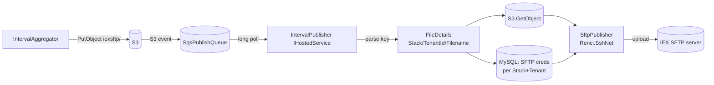

# Module: integrations-wfm-intervalpublisher

## Architecture Overview

IntervalPublisher is a **C#/.NET `IHostedService`** that pushes historic interval files from S3 to tenant SFTP endpoints. It long-polls an SQS queue fed by S3 PutObject event notifications (when IntervalAggregator writes a file into the `iexsftp/` prefix), retrieves the file from S3, looks up per-tenant SFTP credentials from MySQL, and uploads via SFTP using `Renci.SshNet`.

This service is **IEX-only in the current code** — no CxOne S3 publisher implementation exists. If/when CxOne file delivery is wired up, it would be a sibling `IPublishingClient` implementation here.

### Tech stack

- C# / .NET (`IHostedService` background pattern)
- ASP.NET Core (DI + Startup)
- AWS SDK for S3 + SQS
- `Renci.SshNet` SFTP client
- MySQL (Dapper-style) for tenant SFTP credentials

### Entry points

```
integrations-wfm-intervalpublisher/WfmIntervalPublisher/
├── Program.cs
├── Startup.cs                                # DI: IQueueClient->SqsClient, IPublishingClient->SftpPublisher (line 111-112)
├── IntervalPublisher.cs                      # IHostedService loop (line 56, 172-174)
├── QueueClient/SqsClient.cs                  # SQS long-poll listener
├── PublishingClient/SftpPublisher.cs         # PublishIntervalReport (line 79, 116, 230-245)
├── Controllers/                              # health, admin
├── DataAccess/                               # MySQL tenant + SFTP credential lookup
└── DTOs/FileDetails.cs                       # S3 key parse result
```

### Request lifecycle



### External dependencies

- **S3** — source bucket (interval-data bucket) with `iexsftp/` prefix
- **SQS** — `SqsPublishQueue` (S3 event notifications)
- **MySQL (Aurora)** — per-tenant SFTP credentials via stored procedure `Interval_GetSftpConnectionsByTenantStack` (`DatabaseConnector.cs` line 180) returning `SftpConnectionData` DTO. The underlying table is `tbl_409_iex_config` which has both IEX REST and SFTP columns (`sftp_host`, `sftp_port`, `sftp_target_path`, `sftp_user_name`, `sftp_password`).
- **Tenant SFTP servers** — IEX-side; one per tenant
- **CloudWatch** — metrics + logs

---

## Core Components

### `IntervalPublisher.cs` (`IHostedService`)

```csharp
public class IntervalPublisher : IHostedService {
    public Task StartAsync(CancellationToken ct);   // starts SqsClient.StartListener (line 56)
    private async Task GetMessagesUntilQueueEmpty();// continuous poll
    private FileDetails ParseS3Key(string key);     // line 172-174: splits "/" -> {1}=Stack, {2}=TenantId, {3}=FileName
}
```

The service runs a continuous poll: while there are messages on `SqsPublishQueue`, it processes each by:

1. Parsing the S3 key into stack / tenant / filename
2. Looking up the tenant's SFTP connection in MySQL
3. Fetching the file body from S3
4. Uploading via SFTP

### `SqsClient.cs` (`IQueueClient`)

```csharp
public class SqsClient : IQueueClient {
    public void StartListener();   // line 56 of IntervalPublisher.cs invokes this
    public Task<List<Message>> ReceiveMessages();
}
```

Reads SQS queue name from `config["SqsPublishQueue"]` (SqsClient.cs line 64).

### `SftpPublisher.cs` (`IPublishingClient`)

```csharp
public class SftpPublisher : IPublishingClient {
    public async Task PublishIntervalReport(FileDetails fileDetails, TenantData tenantData);
    // line 79:    fetch S3 file
    // line 116:   query SFTP credentials from DB
    // line 230-245: upload via Renci.SshNet SftpClient
}
```

**Tenant-driven routing**: The `iexsftp/{Stack}/{Tenant}/{file}` key tells the service which tenant SFTP endpoint to use. There is **no hardcoded prefix check** — routing is determined by the database SFTP-connection lookup for that (Stack, Tenant).

### `FileDetails` DTO

Parsed from the S3 key:

```
key:  iexsftp/{IexStack}/{TenantId}/{FileName.xml}
              segments[1]    segments[2]   segments[3]
```

### Invariants

- One SQS message = one file = one SFTP upload
- SFTP credentials are resolved per (Stack, Tenant) from MySQL; rotation requires no code changes
- Failed uploads do NOT delete the SQS message → visibility timeout → retry → eventually DLQ
- Only `IPublishingClient` implementation is `SftpPublisher` — no CxOne S3 publisher in this codebase

---

## Service Interactions

### Inbound

- `SqsPublishQueue` SQS messages — S3 object-created events for the bucket+prefix

### Outbound

- S3 `GetObject` (interval-data bucket)
- MySQL `SELECT` for tenant + SFTP connection (Dapper queries)
- SFTP upload via Renci.SshNet to tenant IEX SFTP host
- CloudWatch metrics + logs

### Auth

- AWS: ECS task role for SQS, S3, CloudWatch
- MySQL: credentials from Secrets Manager
- SFTP: per-tenant username/password (or key) from MySQL `SftpConnectionData`

### Error & retry

- S3 fetch failure → throw → SQS visibility timeout → redelivery
- SFTP auth/connect failure → throw → redelivery; persistent → DLQ
- Bad S3 key format → log + drop (record metric, do not block queue)

---

## Data Models

### `TenantData`

Per-tenant metadata loaded from Aurora; identifies the tenant and links to SFTP connection.

### `SftpConnectionData` (DTO)

A C# DTO populated from the result set of `Interval_GetSftpConnectionsByTenantStack` (`DatabaseConnector.cs` line 180). The underlying row lives in `tbl_409_iex_config` (see `wfm-database`). DTO fields correspond to the `sftp_*` columns of that table:

- `sftp_host`, `sftp_port`, `sftp_user_name`, `sftp_password`, `sftp_target_path`

Resolved per (`iex_stack`, tenant identifier).

### Input file

XML interval file written by `IexReportGenerator` to `iexsftp/{Stack}/{Tenant}/MMddyy.HHmm.xml`.

---

## Conventions & Patterns

### File layout

```
WfmIntervalPublisher/
├── Program.cs
├── Startup.cs                          # DI: SqsClient, SftpPublisher (line 111-112)
├── IntervalPublisher.cs                # IHostedService
├── QueueClient/
│   └── SqsClient.cs                    # SqsPublishQueue listener
├── PublishingClient/
│   ├── IPublishingClient.cs
│   └── SftpPublisher.cs                # Renci.SshNet uploader
├── DataAccess/                         # MySQL tenant + SFTP lookup
├── DTOs/                               # FileDetails, TenantData, SftpConnectionData
├── Controllers/                        # health, admin
└── appsettings.json                    # logging only; queue/bucket via env vars
```

### Logging

- Structured JSON to CloudWatch `integrations-wfm-intervalpublisher`
- Correlation: `stack`, `tenantId`, `s3Key`, `sftpHost`, `bytes`, upload duration

---

## Configuration

### Environment variables

```bash
SqsPublishQueue                  # S3-event SQS notification queue (SqsClient.cs line 64)
NICEWFM_REGION                   # AWS region
# Plus Secrets Manager refs for MySQL credentials
```

### `appsettings.json`

Contains `Logging` config only — runtime values from env vars.

### MySQL connection

Tenant + SFTP connection data lives in the platform's tenant DB (likely the same Aurora cluster other services use). Credentials from Secrets Manager.

---

## Common Tasks

### Verify IEX SFTP delivery for a tenant

1. Aggregator wrote the file: `aws s3 ls s3://<bucket>/iexsftp/<Stack>/<Tenant>/`
2. SQS event landed: check `SqsPublishQueue` recent messages or CloudWatch metric.
3. IntervalPublisher processed it: search CloudWatch logs for the file key.
4. SFTP upload succeeded: look for upload-success log entry; if not, check tenant SFTP host reachability.

### Add a CxOne S3 publisher (when implemented)

1. Implement a new `IPublishingClient` (e.g., `CxOneS3Publisher`) that uploads to the CxOne S3 bucket.
2. Register in `Startup.cs` (line 111-112 pattern) — keyed by prefix or content-type.
3. Add routing in `IntervalPublisher` based on S3 key prefix (`iexsftp/` vs `cxonewfm/`).
4. Add unit tests under `wfm-intervalpublisher.xunit_tests/` (or equivalent).

### Update a tenant's SFTP credentials

Update the `sftp_*` columns in `tbl_409_iex_config` for the relevant (Stack, Tenant). Next file upload picks it up — no service restart needed.

### Diagnose SFTP failures

1. `Renci.SshNet` typically logs detailed exceptions — check CloudWatch for them
2. Verify SFTP host reachable from ECS subnet (NACL, SG, NAT)
3. Verify credentials by manually `sftp <host>` from a bastion host

---

## Troubleshooting

| Symptom | Diagnosis |
|---------|-----------|
| SQS depth growing | IHostedService not running, or every message failing SFTP |
| Specific tenant failing | `SftpConnectionData` wrong for (Stack, Tenant); host unreachable; auth failure |
| Files in S3 but no SQS messages | S3 bucket event notification config missing for `iexsftp/` prefix |
| Bad S3 key parse | Aggregator wrote the file under an unexpected path — confirm `iexsftp/{Stack}/{Tenant}/{file}` |
| SFTP uploads succeed but IEX shows nothing | Wrong remote path on SFTP server or IEX consumer broken |

---

## Reference Files

- `WfmIntervalPublisher/Program.cs`
- `WfmIntervalPublisher/Startup.cs` (lines 70, 111-112)
- `WfmIntervalPublisher/IntervalPublisher.cs` (lines 56, 172-174)
- `WfmIntervalPublisher/QueueClient/SqsClient.cs` (line 64)
- `WfmIntervalPublisher/PublishingClient/SftpPublisher.cs` (lines 79, 116, 230-245)
- `WfmIntervalPublisher/DataAccess/` — MySQL tenant + SFTP lookups
- `WfmIntervalPublisher/Controllers/` — health + admin

### Related skills

- `wfm-aggregator` — generates the IEX XML files this service consumes
- `wfm-verintpublisher` — sibling file-driven publisher for Verint REST (different protocol)
- `wfm-statepublisher` — different service: real-time agent state to IEX ASCWS over REST (not SFTP)
- `wfm-execution-flow` — historic-interval file pipeline
- `wfm-dependency-mapping` — S3 prefix ownership + SQS queue
- `wfm-observability` — log group + metrics
