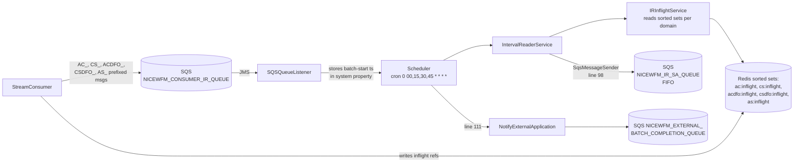

# Module: integrations-wfm-intervalreader

## Architecture Overview

IntervalReader is a **Java Spring Boot service with `@EnableScheduling`** that coordinates the interval-aggregation batch run. Every 15 minutes it:

1. Reads batch-start signals received via JMS from `NICEWFM_CONSUMER_IR_QUEUE` (prefixed: `AC_`, `CS_`, `ACDFO_`, `CSDFO_`, `AS_` — one per event domain)
2. Reads **4 of the 5 defined Redis sorted-set "inflight" keys** (`ac:inflight`, `cs:inflight`, `acdfo:inflight`, `csdfo:inflight`). **`as:inflight` is defined as a constant but excluded from the `INFLIGHT_KEYS` array** that the scheduler iterates over (`IntervalReaderContants.java` line 53; `Scheduler.java` line 102 uses `CountDownLatch(4)`) — these hold unprocessed event references queued by StreamConsumer
3. Sends interval batch messages to the downstream **`NICEWFM_IR_SA_QUEUE`** FIFO queue (consumed by the aggregation path)
4. Notifies the external batch-completion queue (`NICEWFM_EXTERNAL_BATCH_COMPLETION_QUEUE_NAME`)

It is **not** a plain SQS batch consumer with a single distributed lock — the model is cron + per-domain Redis sorted sets + FIFO output for ordering.

### Tech stack

- Java / Spring Boot
- `@EnableScheduling` (cron-driven)
- Spring JMS listener on SQS (for batch-start signals)
- Redisson `RScoredSortedSet` for inflight keys
- AWS SDK SQS (FIFO producer + external notification queue)

### Entry point

```
src/main/java/com/nicewfm/interval/reader/
├── NiceWfmIntervalReaderApplication.java   # @SpringBootApplication + @EnableScheduling
├── scheduler/Scheduler.java                # cron entry (line 111 sends external notify)
├── service/IntervalReaderService.java      # batch processing (line 98 sends to aggregator SQS)
├── service/IRInflightService.java          # Redis inflight reader (lines 42-62)
├── sqs/SQSQueueListener.java               # JMS listener (lines 42-78) for batch-start signals
└── service/NotifyExternalApplication.java  # external completion notification
```

### Request lifecycle



### External dependencies

- **SQS** — `NICEWFM_CONSUMER_IR_QUEUE` (in), `NICEWFM_IR_SA_QUEUE` FIFO (out), external completion queue (out)
- **Redis** — five sorted-set inflight keys (one per event domain)
- **CloudWatch** — metrics + logs

---

## Core Components

### `Scheduler.java`

Cron entry — runs every 15 min by default (`NICEWFM_INTERVAL_SCHEDULER_CRON_EXPRESSION` = `0 00,15,30,45 * * * *`). On each tick:

1. Reads the batch-start timestamp set by `SQSQueueListener` from a system property
2. Calls `IntervalReaderService.process(...)` to send batches
3. Calls `NotifyExternalApplication.notifyExternalQueueForAllIntervals()` (line 111)

### `IntervalReaderService.java`

Core batch processor:

```java
public class IntervalReaderService {
    public void process(...)
    // line 98: SqsMessageSender.sendToSqs(NICEWFM_IR_SA_QUEUE, message)
}
```

Reads from the appropriate Redis inflight sorted sets via `IRInflightService` and emits one or more SQS messages to the downstream FIFO queue.

### `IRInflightService.java` (lines 42-62)

Manages the five inflight keys. Each represents domain-specific unprocessed event references that StreamConsumer has queued:

| Key | Domain | Processed by scheduler? |
|-----|--------|-------------------------|
| `ac:inflight` | Agent contact | Yes |
| `cs:inflight` | Contact skill | Yes |
| `acdfo:inflight` | DFO agent contact | Yes |
| `csdfo:inflight` | DFO contact skill | Yes |
| `as:inflight` | Agent session | **Defined but NOT in `INFLIGHT_KEYS` array** — currently unused by the scheduler loop. `SQSQueueListener.java` lines 66-68 still receives `AS_`-prefixed signals but they never advance to processing. |

Backed by `ElastiCacheOperations` (Redisson `RScoredSortedSet`). Locks here are **per-domain sorted sets**, not a single distributed mutex. The scheduler uses `CountDownLatch(4)` and a fixed thread pool of 4 to process the 4 active keys (`Scheduler.java` line 160).

### `SQSQueueListener.java` (lines 42-78)

```java
@JmsListener(destination = "${awsservice.sqs.listenerQueueName}")
public void onMessage(Message m);
```

Receives **batch-start signals** with prefixes `AC_`, `CS_`, `ACDFO_`, `CSDFO_`, `AS_` (one per domain). Each signal carries a timestamp marking the start of a new batch. The listener stores the timestamp in a system property; the scheduler reads it on the next tick to align processing.

### Dual-write Redis infrastructure

The codebase includes a dual-write Redis abstraction (`DualRedissonClientFactory`, `DualWriteConfig`, `DualWriteStrategy`, `DualWriteWrapper`) — verify before assuming any single-cluster behavior. Use this when planning Redis migrations.

### Outage detection

`Scheduler.java` lines 172-194 compare `lastProcessedBatch` against the current interval window to detect downtime and trigger recovery. Custom CloudWatch metrics are emitted by `IntervalReaderCWHelper.java` (push time, outage count, exception counters).

### `NotifyExternalApplication.java`

Sends a `DynamoIntervalReady` JSON message to the SQS queue `NICEWFM_EXTERNAL_BATCH_COMPLETION_QUEUE_NAME` (verified `NotifyExternalApplication.java` lines 113-130 — uses `sqsClient.sendMessage()` with FIFO `messageGroupId` + `messageDeduplicationId`). This is **SQS, not HTTP**.

### Invariants

- Output is a **FIFO queue** (`NICEWFM_IR_SA_QUEUE` ends in `.fifo`) — preserves per-tenant interval ordering
- The five Redis sorted-set keys are independent; each domain is processed independently
- Scheduler is cron-driven, NOT pure event-driven — batch-start signals only set timestamps
- Lookback window controlled by `NICEWFM_SCHEDULER_INTERVAL_DIFF_IN_MINUTES` (default 15)

---

## Service Interactions

### Inbound

- **JMS / SQS** from `NICEWFM_CONSUMER_IR_QUEUE` (StreamConsumer produces) — batch-start signals
- **Redis read** of five inflight sorted-set keys (StreamConsumer writes them)

### Outbound

- **SQS FIFO** to `NICEWFM_IR_SA_QUEUE` (`integrations-ir-saqueue.fifo`) — for aggregation
- **SQS** to `NICEWFM_EXTERNAL_BATCH_COMPLETION_QUEUE_NAME` — external completion notification
- **CloudWatch** metrics + logs

### Auth

- ECS task role: SQS read/write (multiple queues), CloudWatch
- Redis: cluster credentials via Redisson config

### Failure recovery

- Cron tick fails → next tick (15 min later) reads cumulative inflight again
- FIFO send failure → AWS SDK retries with exponential backoff
- Service crash → batch-start timestamps are persisted in Redis ordering, so no data is lost — next service start resumes

---

## Data Models

### Inflight sorted sets

Each Redis key is an `RScoredSortedSet` where:

- **Score** = event timestamp
- **Value** = event reference (tenant + event ID + payload hint)

`IRInflightService` reads by score range to pick the right interval window.

### Batch-start signal

```
SQS body: "<PREFIX>_<timestamp>"  // e.g., AC_2026-05-23T15:00:00Z
```

### Output message to aggregator SQS

JSON describing tenant + interval window + which domain batches are ready. Consumed by the upstream aggregator path (the C# aggregator side, or a Java aggregator wrapper depending on deployment).

---

## Conventions & Patterns

### File layout

```
src/main/java/com/nicewfm/interval/reader/
├── NiceWfmIntervalReaderApplication.java
├── scheduler/Scheduler.java               # cron job
├── service/                                # IntervalReaderService, IRInflightService, NotifyExternalApplication
├── sqs/SQSQueueListener.java               # batch-start JMS listener
├── redis/ElastiCacheOperations            # Redisson helper
├── config/                                 # SQS, Redis, scheduler beans
└── model/                                  # message + batch POJOs
```

### Logging

- Logstash JSON encoder → CloudWatch `integrations-wfm-intervalreader`
- Correlation: `tenantId`, `batchStartTs`, `domain` (ac/cs/acdfo/csdfo/as), `inflightCount`

---

## Configuration

### Environment variables / `application.yml` (lines 5-38)

```yaml
awsservice:
  region: ${NICEWFM_REGION}
  sqs:
    listenerQueueName: ${NICEWFM_CONSUMER_IR_QUEUE:integrations-consumer-irqueue}
    queuename:          ${NICEWFM_IR_SA_QUEUE:integrations-ir-saqueue.fifo}
    externalBatchCompletionQueueName: ${NICEWFM_EXTERNAL_BATCH_COMPLETION_QUEUE_NAME}
  redis:
    url:  ${NICEWFM_REDIS_URL}
    port: ${NICEWFM_REDIS_PORT}

scheduler:
  cron:                ${NICEWFM_INTERVAL_SCHEDULER_CRON_EXPRESSION:0 00,15,30,45 * * * *}
  intervalDiffMinutes: ${NICEWFM_SCHEDULER_INTERVAL_DIFF_IN_MINUTES:15}

application:
  name: ${NICEWFM_INTERVAL_READER_APPLICATIONNAME}
```

---

## Common Tasks

### Diagnose stuck batches

1. Inspect Redis sorted set sizes per domain:
   ```bash
   redis-cli ZCARD ac:inflight
   redis-cli ZCARD cs:inflight
   redis-cli ZCARD acdfo:inflight
   redis-cli ZCARD csdfo:inflight
   redis-cli ZCARD as:inflight
   ```
2. If a domain keeps growing, the scheduler isn't processing it — check CloudWatch logs.
3. If `NICEWFM_IR_SA_QUEUE` has stuck messages, the downstream aggregator side is the bottleneck.

### Adjust cadence

Set `NICEWFM_INTERVAL_SCHEDULER_CRON_EXPRESSION` to a different cron. The lookback window (`NICEWFM_SCHEDULER_INTERVAL_DIFF_IN_MINUTES`) should match.

### Drain a stuck domain manually

If a sorted set is corrupted or stuck:
```bash
# Inspect first
redis-cli ZRANGE ac:inflight 0 -1 WITHSCORES

# Drain (use with caution — may cause skipped data)
redis-cli DEL ac:inflight
```

### Verify FIFO ordering

Check that the FIFO queue's `MessageGroupId` preserves per-tenant ordering (each tenant should be a separate group ID).

---

## Troubleshooting

| Symptom | Diagnosis |
|---------|-----------|
| `NICEWFM_IR_SA_QUEUE` empty across cron ticks | All five inflight keys empty (StreamConsumer not producing) or scheduler not firing |
| Specific domain backlog (e.g., `acdfo:inflight` huge) | DFO event throughput exceeds processing rate — scale processor or batch size |
| External notification queue not getting messages | `NotifyExternalApplication` failing — check Scheduler.java line 111 logs |
| Out-of-order events in downstream | FIFO `MessageGroupId` collision; verify per-tenant grouping |
| Duplicate processing after restart | Scheduler runs are idempotent within a 15-min window; investigate cumulative dedup logic |

---

## Reference Files

- `src/main/java/com/nicewfm/interval/reader/NiceWfmIntervalReaderApplication.java`
- `src/main/java/com/nicewfm/interval/reader/scheduler/Scheduler.java` (line 111)
- `src/main/java/com/nicewfm/interval/reader/service/IntervalReaderService.java` (line 98)
- `src/main/java/com/nicewfm/interval/reader/service/IRInflightService.java` (lines 42-62)
- `src/main/java/com/nicewfm/interval/reader/sqs/SQSQueueListener.java` (lines 42-78)
- `src/main/java/com/nicewfm/interval/reader/service/NotifyExternalApplication.java`
- `src/main/resources/application.yml` (lines 5-38)

### Related skills

- `wfm-streamconsumer` — direct upstream (produces batch-start signals + writes Redis sorted sets)
- `wfm-aggregator` — interval aggregation (one of the eventual consumers of the FIFO queue)
- `wfm-execution-flow` — see "Flow 2 — interval data" path
- `wfm-observability` — domain-specific inflight metrics
- `wfm-dependency-mapping` — SQS queue + Redis key ownership
