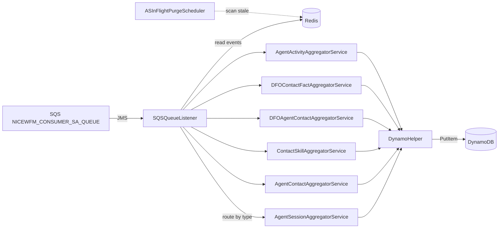

# Module: integrations-wfm-stateaggregator

## Architecture Overview

StateAggregator is the **fan-in stage** of the real-time pipeline. It listens on the SQS queue StreamConsumer publishes to, reads the actual event payloads from Redis, runs them through type-specific aggregator services (group by tenant + time window + entity key), and writes the aggregated result to DynamoDB. A background purge scheduler cleans Redis entries that never got an SQS notification.

### Tech stack

- Java 21, Spring Boot 3.5.9
- AWS SDK v2.29.29 (DynamoDB, SQS, CloudWatch)
- Redisson 3.45.0 (two clients: `MASTER_SLAVE` read mode + `MASTER` read mode)
- `amazon-sqs-java-messaging-lib (Amazon's SQS JMS bridge, not ActiveMQ)` (SQS JMS listener)
- `spring-boot-starter-actuator` (custom health check)

### Entry point

```
src/main/java/com/nicewfm/events/aggregator/StateAggregatorApplication.java
```

Configures and exposes these Spring beans:

- `RedissonClient` — MASTER_SLAVE read mode (replica-preferred)
- `masterRedissonClient` — MASTER read mode (when replica lag matters)
- `DynamoDbClient`
- `CloudWatchClient`
- `SqsClient`

### Request lifecycle



### External dependencies

- **SQS** — consumes TWO queues (verified `SQSQueueListener.java` lines 116, 125):
  - `${nicewfm.aggregator.consumerqueuename}` (env: `NICEWFM_CONSUMER_SA_QUEUE`) — real-time event notifications from StreamConsumer
  - `${nicewfm.aggregator.irqueuename}` (env: `NICEWFM_IR_SA_QUEUE`) — interval-batch FIFO messages from IntervalReader
- **Redis** — reads buffered events written by StreamConsumer
- **DynamoDB** — single aggregated-fact table (`NICEWFM_DYNAMODB_TABLE_NAME`)
- **CloudWatch** — metric and log sink

---

## Core Components

### `SQSQueueListener.java`

```java
// src/main/java/.../listener/SQSQueueListener.java
@Component
public class SQSQueueListener {
    @JmsListener(destination = "${aws.sqs.queueName}")
    public void onMessage(String body);     // entry point per SQS message
}
```

**Responsibility:** decode SQS body → extract event metadata (tenantId, eventType, redisKey) → fetch from Redis → dispatch to the matching aggregator service. JMS auto-acks on success; throws to trigger redelivery.

### Aggregator services

Each service operates on one event family.

| Class | Event family | DynamoDB target |
|-------|--------------|-----------------|
| `AgentSessionAggregatorService` | Agent login/logout/state changes | Session summary rows |
| `AgentContactAggregatorService` | Agent contact handling | Contact summary rows |
| `ContactSkillAggregatorService` | Skill routing | Skill-level facts |
| `DFOAgentContactAggregatorService` | DFO agent contacts | DFO agent rows |
| `DFOContactFactAggregatorService` | DFO contact facts | DFO contact rows |
| `AgentActivityAggregatorService` | Broad agent activity | Activity rollups |

**Common pattern:**

```java
public class XxxAggregatorService {
    public void aggregate(List<RawEvent> events) {
        // 1. Group by (tenantId, timeWindow, entityKey)
        // 2. Compute aggregates (durations, counts, transitions)
        // 3. dynamoInserter.put(buildAggregatedRow(...))
    }
}
```

### `DynamoHelper.java` + `DynamoInserter.java`

```
src/.../database/DynamoHelper.java   — builds PutItemRequest / QueryRequest
src/.../database/DynamoInserter.java — executes writes, retries, logs errors
```

Writes are **individual `PutItem`** calls (not batch). `DynamoInserter` handles transient retry and emits `DynamoDBWriteErrors` on persistent failure.

### `ASInFlightPurgeScheduler.java`

```
src/.../scheduler/ASInFlightPurgeScheduler.java
```

Periodically scans Redis for orphaned events — events buffered by StreamConsumer where the SQS notification was lost (rare). Prevents Redis memory bloat. Emits `InFlightPurgeCount` metric.

### `HealthCheckController.java`

Custom endpoint verifying Redis (MASTER_SLAVE client), DynamoDB reachability, and SQS queue accessibility.

### Invariants

- One SQS message → one Redis read → one or more DynamoDB writes
- All time math is **UTC**; aggregation windows are defined per service
- A message that fails aggregation must throw so SQS redelivers it
- The purge scheduler is the **only** writer to Redis here (deletes only)

---

## Service Interactions

### Inbound

- **SQS** (`NICEWFM_SA_QUEUE_NAME`) — listened on by `SQSQueueListener` via Spring JMS
- **Redis** (read-only) — events written by StreamConsumer; both Redisson clients used depending on whether replica lag is acceptable

### Outbound

- **DynamoDB** — `PutItem` calls; downstream readers (e.g., VerintPublisher) read these aggregated rows
- **CloudWatch** — metrics + logs

### Auth / IAM

ECS task role needs:

- `sqs:ReceiveMessage`, `sqs:DeleteMessage`
- `dynamodb:PutItem`, `dynamodb:Query`
- `cloudwatch:PutMetricData`
- ElastiCache cluster access (Redis)

### Error & retry

- JMS auto-redelivers on exception (SQS visibility timeout)
- DynamoDB throttling: AWS SDK v2 built-in retry; persistent failure surfaces as `DynamoDBWriteErrors`
- Redis miss: usually means StreamConsumer failed — log + drop OR throw based on policy

---

## Data Models

### Inbound SQS message

```json
{
  "tenantId": "...",
  "eventType": "AGENT_SESSION | AGENT_CONTACT | CONTACT_SKILL | DFO_AGENT_CONTACT | DFO_CONTACT_FACT | AGENT_ACTIVITY",
  "redisKey": "<tenant>:<type>:<id>"
}
```

### Outbound DynamoDB row

Shape varies by aggregator service; common fields:

- Partition key: `<tenantId>#<entityType>#<entityKey>`
- Sort key: time-window start (UTC ISO)
- Attributes: counts, durations, last-state transitions, aggregation timestamp

VerintPublisher reads these rows on its schedule — schema changes here are a contract change with VerintPublisher.

### Caching

- Two Redisson clients let the service choose between read-from-replica (fast, possibly stale by ~ms) and read-from-master (authoritative)

---

## Conventions & Patterns

### File layout

```
src/main/java/com/nicewfm/events/aggregator/
├── StateAggregatorApplication.java
├── listener/                      # SQSQueueListener
├── service/                       # *AggregatorService classes
├── database/                      # DynamoHelper, DynamoInserter
├── scheduler/                     # ASInFlightPurgeScheduler
├── controller/                    # HealthCheckController
├── model/                         # raw event + aggregated row POJOs
├── config/                        # Spring beans (Redis, Dynamo, SQS, CW)
└── metrics/                       # CloudWatch metric publishers
```

### Naming

- Services: `<EventFamily>AggregatorService`
- Models: `<EventFamily>Event` + `<EventFamily>Summary`
- Aurora references: none — this service does NOT talk to Aurora

### Testing

- `src/test/java/.../service/` — JUnit + Mockito
- DynamoDB mocked via `DynamoDbClient` stubs

### Logging

- Logstash JSON encoder
- Correlation fields: `tenantId`, `eventType`, `recordId`, `aggregationWindow`

---

## Configuration

### Environment variables

```bash
NICEWFM_REDIS_URL              # ElastiCache endpoint
NICEWFM_REDIS_PORT             # Redis port
NICEWFM_SA_QUEUE_NAME          # SQS queue
NICEWFM_DYNAMODB_TABLE_NAME    # DynamoDB aggregated-fact table
AWS_REGION                     # AWS region (DynamoDB + other AWS clients)
NICEWFM_REGION                 # AWS region
NICEWFM_METRIC_NAMESPACE       # CloudWatch namespace
NICEWFM_METRIC_LEVEL           # INFO
```

---

## Common Tasks

### Add a new aggregator service

1. Create `service/NewFamilyAggregatorService.java` with `aggregate(List<RawEvent>)`.
2. Add a `model/NewFamilyEvent.java` (raw) and `model/NewFamilySummary.java` (aggregated).
3. Extend `DynamoHelper.buildPutItemRequest(...)` for the new summary type.
4. Add `eventType → service` routing in `SQSQueueListener`.
5. Add a new CloudWatch counter for `NewFamilyAggregations`.
6. Coordinate with **VerintPublisher** if the new DynamoDB rows must be published.
7. Update `wfm-stateaggregator` and `wfm-verintpublisher` skills.

### Adjust replica-vs-master read

- For reads that must reflect very recent writes (rare), inject the bean qualified `@Qualifier("masterRedissonClient")`
- For everything else, the default MASTER_SLAVE client is fine

### Trigger purge manually

The `ASInFlightPurgeScheduler` runs on a schedule; manual triggering normally not needed. If Redis bloat is suspected, check `InFlightPurgeCount` metric is rising.

---

## Troubleshooting

| Symptom | Diagnosis |
|---------|-----------|
| SQS queue depth rising | Listener not consuming — check `SQSQueueListener` logs, JMS connection, IAM |
| `DynamoDBWriteErrors` rising | DynamoDB throttling or schema mismatch — check capacity + `DynamoHelper` mapping |
| Redis miss errors | StreamConsumer never wrote, or purge scheduler too aggressive |
| Aggregated rows missing | Wrong service routing — check `eventType` dispatch in `SQSQueueListener` |
| Verint missing data downstream | Schema drift between this service's writes and VerintPublisher's reads |

---

## Reference Files

- `integrations-wfm-stateaggregator/pom.xml`
- `src/main/java/.../StateAggregatorApplication.java`
- `src/main/java/.../listener/SQSQueueListener.java`
- `src/main/java/.../service/*AggregatorService.java`
- `src/main/java/.../database/DynamoHelper.java`
- `src/main/java/.../database/DynamoInserter.java`
- `src/main/java/.../scheduler/ASInFlightPurgeScheduler.java`
- `src/main/java/.../controller/HealthCheckController.java`
- `src/main/resources/application.yml`
- `src/main/resources/logback.xml`

### Related skills

- `wfm-streamconsumer` — direct upstream (writes Redis + sends SQS to this service)
- `wfm-verintpublisher` — direct downstream (reads DynamoDB)
- `wfm-execution-flow` — Flow 1 pipeline
- `wfm-dependency-mapping` — DynamoDB schema ownership
- `wfm-observability` — alarms + log fields
