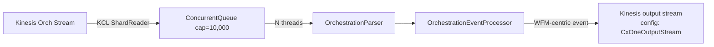

# Module: integrations-wfm-statecollector

## Architecture Overview

StateCollector is the **C# arm of the real-time pipeline**. It runs as an `IHostedService` that maintains a Kinesis Client Library reader, buffers incoming records in a bounded `ConcurrentQueue`, and uses N processor threads to parse + transform each record into a WFM-centric event published to a second Kinesis stream consumed by `wfm-statepublisher` (→ IEX ASCWS).

The Java `wfm-streamconsumer` also reads the same source orchestration stream but routes differently — both consume the stream in parallel as different KCL applications.

> **Real-time only.** StateCollector feeds the **real-time agent state** path. The **historic-interval file** pipeline (`wfm-aggregator` → S3 → `wfm-verintpublisher` / `wfm-intervalpublisher`) is independent and uses DynamoDB as its data source, not Kinesis WFM State.

### Tech stack

- C# / .NET Core
- Kinesis Client Library (C# port)
- `IHostedService` (background service)

### Entry point

```
integrations-wfm-statecollector/wfm-statecollector/StateCollector.cs   (line 35: IHostedService; version V3.0.0.3 at line 47)
integrations-wfm-statecollector/wfm-statecollector/Startup.cs           (line 135 registers UnifiedStreamClient as IHostedService, NOT StateCollector directly)
```

Note: the hosted service Startup.cs **actually registers** is `UnifiedStreamClient`. `StateCollector` is the worker class used by it.

### Request lifecycle



The reader is **I/O-bound**; the processors are **CPU-bound** — separating them with the queue maximizes throughput. The bounded queue applies back-pressure when processors fall behind.

### External dependencies

- **Kinesis** — source from config `TargetStream`; destination from config `CxOneOutputStream` (output stream name) + `CxOneAccount` (verified `Publisher/StatePublisher.cs` lines 33-34, 44; uses `AwsKinesisProducer`)
- **WfmConfig** — periodic tenant config refresh (`DataCache` loads via REST)
- **CloudWatch** — metrics + logs
- **S3** — TLS certs at startup (`S3/SSLCertificateS3Provider.cs`)

---

## Core Components

### `StateCollector.cs`

```csharp
public class StateCollector : IHostedService {
    public Task StartAsync(CancellationToken ct);    // starts KCL + N processors
    public Task StopAsync(CancellationToken ct);     // graceful shutdown
}
```

Internals:

- `ConcurrentQueue<(string shardId, Record)>` — capacity `MaxRecordsToRead` (default 10,000)
- N = `NumberOfReadingProcessors` threads draining the queue
- Each thread runs the parse → transform → publish loop

### `OrchestrationParser.cs`

Deserializes Kinesis record payloads (JSON) into orchestration event objects. Handles multiple event types and is **version-aware** (supports schema evolution from the ACD/DFO source).

### `OrchestrationEventProcessor.cs`

Transforms parsed orchestration events into WFM-centric state events:
- Field remapping (ACD names → WFM names)
- Tenant ID normalization
- Timestamp standardization to UTC
- Event-type classification
- Custom field inclusion (per-tenant configuration)

Publishes to the WFM State Kinesis stream.

### Invariants

- One KCL reader thread per shard fills the queue
- N processor threads drain it concurrently — they're stateless; can scale by tuning N
- Queue capacity = back-pressure mechanism (KCL blocks when queue is full)
- Output Kinesis stream events carry the original event order **within a shard**

---

## Service Interactions

### Inbound

- KCL reads `TargetStream` (orchestration Kinesis stream)

### Outbound

- Publishes to WFM State Kinesis stream (downstream: StatePublisher)
- WfmConfig REST (periodic tenant/feature config refresh)
- CloudWatch (metrics + logs)

### Auth

- ECS task role: Kinesis read + write, CloudWatch
- Secrets Manager for any per-service secret

### Failure modes

- Kinesis throttling → KCL handles with backoff
- Parser deserialization failure → log + drop the record (schema change suspected)
- Output publish failure → retry; if persistent, surfaces as logs + metric

---

## Data Models

### `appsettings.json`

```json
{
  "TargetStream": "<kinesis-stream-name>",
  "ContainerName": "wfm-statecollector",
  "MaxRecordsToRead": 10000,
  "NumberOfReadingProcessors": 4
}
```

| Setting | Meaning | Default |
|---------|---------|---------|
| `TargetStream` | Source Kinesis stream | required |
| `ContainerName` | Service identifier | `wfm-statecollector` |
| `MaxRecordsToRead` | ConcurrentQueue capacity | 10000 |
| `NumberOfReadingProcessors` | Parallel processing threads | configurable |

### Output event

WFM-centric event JSON, schema defined in DTO classes published to the WFM State Stream and consumed by StatePublisher. Carries `tenantId`, `agentId`, normalized timestamps, and the transformed payload.

---

## Conventions & Patterns

### File layout

```
integrations-wfm-statecollector/wfm-statecollector/
├── StateCollector.cs                   # IHostedService
├── Orchestration/                      # parser + processor
│   ├── OrchestrationParser.cs
│   └── OrchestrationEventProcessor.cs
├── Controllers/                        # health endpoint
├── DataAccess/                         # WfmConfig client, Kinesis publisher
├── DataObjects/                        # DTOs (raw + WFM-centric)
├── Publisher/                          # output stream writer
├── Utilities/                          # encryption, caching, stream helpers
└── appsettings.json
```

### Logging

- Structured JSON → CloudWatch `integrations-wfm-statecollector`
- Correlation: `tenantId`, `shardId`, `sequenceNumber`, `eventType`

### Health

Port 8080 health endpoint checked by ECS task health probe.

---

## Configuration

### Environment variables

```bash
TargetStream                     # source Kinesis stream
NumberOfReadingProcessors        # thread count
MaxRecordsToRead                 # queue capacity

NICEWFM_REGION                   # AWS region
ENCRYPTION_IN_TRANSIT_MODE
ENABLE_FIPS
SERVER_CERTIFICATE_URI / KEY_URI # S3 TLS cert paths

# WfmConfig endpoint
NICEWFM_CONFIG_URL
```

---

## Common Tasks

### Increase throughput

- Source stream too slow: increase shard count on `TargetStream`
- Processors too slow: increase `NumberOfReadingProcessors`
- Queue full warnings: increase `MaxRecordsToRead` (memory cost)

### Handle a new orchestration event schema

1. Update `OrchestrationParser.cs` to recognize the new version field
2. Add or extend the corresponding DTO class
3. Update `OrchestrationEventProcessor.cs` mapping
4. Add unit tests covering both old and new schema versions

### Diagnose dropped events

1. Check CloudWatch for parser errors — schema mismatch?
2. Check queue-full metric — back-pressure tripping KCL reader?
3. Check output publish error rate — Kinesis throttling?

---

## Troubleshooting

| Symptom | Diagnosis |
|---------|-----------|
| Output stream empty | KCL not reading? `TargetStream` env var wrong? IAM missing? |
| High parse errors | New schema upstream — add a parser version |
| Queue full | Processors too slow — bump `NumberOfReadingProcessors` |
| StatePublisher missing data | Verify this service is publishing — check output Kinesis stream + CloudWatch logs |

---

## Reference Files

- `integrations-wfm-statecollector/wfm-statecollector/StateCollector.cs`
- `Orchestration/OrchestrationParser.cs`
- `Orchestration/OrchestrationEventProcessor.cs`
- `Publisher/` — output stream writers
- `appsettings.json`
- `Dockerfile`
- ECS task: `boot/wfm-statecollector-Service-task.json`

### Related skills

- `wfm-statepublisher` — direct downstream (reads WFM State Stream)
- `wfm-streamconsumer` — Java parallel consumer of the same source stream
- `wfm-execution-flow` — Flow 1 Step 2
- `wfm-dependency-mapping` — Kinesis stream ownership
- `wfm-observability` — log group + metrics
