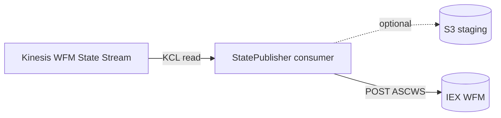

# Module: integrations-wfm-statepublisher

## Architecture Overview

StatePublisher is the **terminal stage for IEX-bound real-time agent state**. It consumes the WFM State Kinesis stream (produced by StateCollector), optionally stages data in S3, and POSTs to IEX's ASCWS (Agent State Capture Web Service) REST API.

> **Real-time only.** StatePublisher handles ASCWS real-time agent state. **Historic interval files for IEX are a different pipeline** — they're produced by IntervalAggregator (`IexReportGenerator` → `s3://<bucket>/iexsftp/{Stack}/{Tenant}/*.xml`) and pushed via SFTP by `wfm-intervalpublisher`. These two pipelines do not share code or runtime path.

### Tech stack

- C# / .NET Core
- ASP.NET Core (REST controllers + DI host)
- HTTP client → IEX ASCWS REST
- S3 client for optional staging
- Reads tenant config from WfmConfig

### Entry point

```
integrations-wfm-statepublisher/Wfm-StatePublisher/
├── Controllers/        — REST endpoints (health, admin, publish control)
├── DataAccess/         — IEX HTTP client, S3 helper
├── Services/           — core publishing pipeline
└── Utilities/          — health checks, metrics
```

### Request lifecycle



### External dependencies

- **Kinesis WFM State Stream** — produced by StateCollector
- **IEX WFM REST (ASCWS)** — publishing target
- **S3** — optional staging/archival bucket
- **WfmConfig REST** — tenant configuration (publishing rules, target overrides)
- **CloudWatch** — metrics + logs
- **Secrets Manager** — IEX credentials

---

## Core Components

### Consumer / publishing service

Listens to the WFM State Stream via KCL, batches events appropriately for IEX, and POSTs to ASCWS. Records latency and HTTP outcome per call.

### Controllers

REST endpoints for:
- Health (`GET /health` or similar)
- Admin / operational tasks (e.g., pause publishing, replay window — varies by env)

### IEX HTTP client

`Http/ASCWSHttpClientHandler.cs` implements `IASCWSHttpHandler`. Wraps `HttpClient` for ASCWS POSTs. Authentication uses `JWTGenerator` + `TokenCache` (registered in Program.cs lines 81-82). The actual outbound pipeline goes through `IAscwsService` (Program.cs line 83).

### S3 staging (optional)

When configured, writes a copy of each batch to S3 for archival/audit/replay.

### Invariants

- Events from the WFM State Stream are already WFM-centric — no further transformation here
- IEX call ordering should preserve the per-agent timeline (within a Kinesis shard, KCL guarantees order)
- Credentials must be present at startup; failed creds → service won't start

---

## Service Interactions

### Inbound

- Kinesis WFM State Stream

### Outbound

- IEX ASCWS REST
- S3 (optional staging)
- WfmConfig REST (config refresh)
- CloudWatch (metrics + logs)

### Auth

- AWS: ECS task role (Kinesis read, S3 write, CloudWatch)
- IEX: JWT auth via `JWTGenerator` + `TokenCache` (Program.cs lines 81-82) consumed by `ASCWSHttpClientHandler`
- WfmConfig: JWT Bearer (config service requires it)

### Retry

- Transient ASCWS errors: retry per HTTP policy
- Persistent failure: alarm-driven via CloudWatch + DLQ-like S3 staging if configured

---

## Data Models

### Inbound (WFM State Stream record)

The transformed event published by StateCollector — JSON with normalized `tenantId`, `agentId`, state info, and timestamps.

### Outbound (IEX ASCWS payload)

Defined by IEX's schema. Mapping logic lives in the publishing service.

### Config-driven routing

- Tenant-level enablement controlled by WfmConfig
- `SegmentedByDivisions` from `TenantStatus` may affect how state is grouped before publishing

---

## Conventions & Patterns

### File layout

```
integrations-wfm-statepublisher/Wfm-StatePublisher/
├── Program.cs
├── Startup.cs
├── Controllers/
├── Services/                 # publishing pipeline
├── DataAccess/               # IEX client, S3 client
├── Utilities/                # health, metrics
└── appsettings.json
```

### Logging

- Structured JSON → CloudWatch `integrations-wfm-statepublisher`
- Correlation: `tenantId`, `agentId`, `iexEndpoint`, HTTP status

---

## Configuration

`appsettings.json` only contains `Logging`. All runtime values flow through `IConfiguration` (env vars / Secrets Manager). The following config keys are confirmed in code; env-var names are **not** constants in source — inspect the ECS task definition for actual env-var mappings:

| Config key | Source / use |
|------------|--------------|
| `UnifiedStreamName` | Input Kinesis stream (Program.cs line 86) |
| Other ASCWS / S3 / WfmConfig settings | Loaded via `IConfiguration`. Specific env-var names are deployment-defined, not hardcoded. |

**Internal queueing**: `AgentStateQueue<AgentStateASCWS>` between the Kinesis consumer and the ASCWS publisher — no external SQS used by this service.

**S3 usage**: Limited to TLS cert download at startup (`S3/SSLCertificateS3Provider.cs`). No data-staging S3 PutObject calls were found.

---

## Common Tasks

### Change IEX endpoint per environment

Update the ASCWS-URL config value in the ECS task definition (env-var name is deployment-defined; inspect the task definition). Restart task.

### Enable S3 staging

Set `NICEWFM_S3_BUCKET` and `NICEWFM_S3_PREFIX`. Confirm ECS task role has `s3:PutObject` on the bucket.

### Replay a window from S3

If S3 staging is enabled, you can re-feed stored payloads into IEX via a one-off script — coordinate with operations.

### Verify SegmentedByDivisions is honored

Check that for a tenant with `SegmentedByDivisions=true`, state events are grouped/segmented per `DivisionIdSet` before POST. This logic is in the publishing service.

---

## Troubleshooting

| Symptom | Diagnosis |
|---------|-----------|
| IEX not receiving state | KCL not consuming WFM State Stream, or HTTP failures to ASCWS |
| 401 from ASCWS | Credentials wrong/expired in Secrets Manager |
| Lag in IEX | Stream consumer behind (CloudWatch consumer-lag metric) |
| Wrong tenant data in IEX | WfmConfig misconfigured — check tenant enablement + `SegmentedByDivisions` |
| S3 writes failing | IAM bucket-policy / `s3:PutObject` missing |

---

## Reference Files

- `integrations-wfm-statepublisher/Wfm-StatePublisher/Program.cs`
- `Startup.cs`
- `Services/` — publishing pipeline
- `DataAccess/ASCWSHttpClientHandler.cs`
- `Controllers/` — health + admin
- `appsettings.json`
- `Dockerfile`
- ECS task: `boot/wfm-statepublisher-Service-task.json`

### Related skills

- `wfm-statecollector` — produces the stream this service consumes
- `wfm-verintpublisher` — sibling publisher targeting Verint instead
- `wfm-config` — provides tenant publishing rules
- `wfm-execution-flow` — Flow 1 parallel path
- `wfm-observability` — log group + metrics
