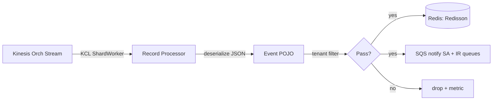

# Module: integrations-wfm-streamconsumer

## Architecture Overview

StreamConsumer is the **Java entry point** into the platform's real-time pipeline. It consumes the orchestration Kinesis stream via the Kinesis Client Library (KCL 2.5.8), routes each record to a type-specific processor, buffers the raw event in Redis, and emits a lightweight SQS notification so downstream services (StateAggregator, IntervalReader) know to pick it up.

### Tech stack

- Java 21, Spring Boot 3.5.9
- AWS SDK v2.25.20 (Kinesis, SQS, CloudWatch, DynamoDB)
- Kinesis Client Library `amazon-kinesis-client:2.5.8`
- Redisson 3.45.0 (cluster mode)
- `logstash-logback-encoder:4.9` (JSON logs)

### Entry point

```
src/main/java/com/nicewfm/streamconsumer/NiceWfmConsumerApplication.java
```

Spring Boot `@SpringBootApplication` — wires KCL workers and registers the record-processor factory.

### Request lifecycle



### External dependencies

- **Kinesis**: orchestration stream (`NICEWFM_STREAM_NAME`)
- **Redis (ElastiCache cluster)**: event buffer (`NICEWFM_REDIS_URL:NICEWFM_REDIS_PORT`)
- **SQS**: `NICEWFM_CONSUMER_SA_QUEUE`, `NICEWFM_CONSUMER_IR_QUEUE`
- **DynamoDB**: KCL lease table (shard ownership)
- **CloudWatch**: KCL emits its own metrics + service metrics

---

## Core Components

### Record processors

Each implements KCL's `ShardRecordProcessor`. One processor handles one event type.

| Class | Event type | Responsibility |
|-------|------------|---------------|
| `AgentSessionRecordProcessor` | Agent login/logout/state | Persist session state event for StateAggregator |
| `AgentContactRecordProcessor` | Agent handling a contact | Persist contact event |
| `ContactSkillRecordProcessor` | Skill routing | Persist skill assignment |
| `CustomFieldsRecordProcessor` | Tenant custom fields | Filtered by `CUSTOM_FIELD_NAMES` env var |
| `ContactDFORecordProcessor` | DFO contact-side events | Persist DFO contact event |
| `AgentContactDFORecordProcessor` | DFO agent-side events | Persist DFO agent-contact event |

**Public interface (each processor):**

```java
public class XxxRecordProcessor implements ShardRecordProcessor {
    public void initialize(InitializationInput input);
    public void processRecords(ProcessRecordsInput input);   // ← main entry
    public void leaseLost(LeaseLostInput input);
    public void shardEnded(ShardEndedInput input);
    public void shutdownRequested(ShutdownRequestedInput input);
}
```

`processRecords` is called by KCL with a batch of records. The processor:
1. Deserializes the JSON payload with Jackson.
2. Filters by tenant (`NICEWFM_TENANT_FILTER_ENABLE`).
3. Writes the event to Redis (keyed by tenant + event ID).
4. Sends a small SQS notification (message body identifies the event location in Redis).
5. Checkpoints with KCL when the batch is fully processed.

### Internal collaborators

- `RedissonClient` bean — Redis writes
- `SqsClient` bean — SQS send
- Jackson `ObjectMapper` — JSON deserialization
- CloudWatch metric publisher

### Invariants

- One processor instance per shard (KCL guarantee)
- Records are processed **in order within a shard**; checkpoint only after success
- Redis writes precede SQS notifications (downstream reader must find the data)
- Tenant filtering happens **before** Redis write (don't buffer events you'll drop)

---

## Service Interactions

### Inbound

- KCL connects to Kinesis stream (`NICEWFM_STREAM_NAME`) using `NICEWFM_CONSUMER_APPLICATIONNAME` as the KCL app name → claims shard leases via a DynamoDB lease table.

### Outbound

- **Redis write** via Redisson cluster client — event buffer (no TTL set here; cleaned by StateAggregator's `ASInFlightPurgeScheduler`).
- **SQS send** to:
  - `NICEWFM_CONSUMER_SA_QUEUE` — triggers StateAggregator
  - `NICEWFM_CONSUMER_IR_QUEUE` — triggers IntervalReader

### Auth

- AWS calls use ECS task role `Role-integrations-ecs-service`
- No direct WfmConfig dependency (tenant filter list comes from env var)

### Retry / error

- KCL handles transient Kinesis read failures
- If Redis or SQS fails inside `processRecords`, the exception propagates → KCL doesn't checkpoint → records retry on next invocation

---

## Data Models

### Inbound record (Kinesis)

JSON payload from ACD/DFO; structure varies by event type. Each processor has its own POJO (in the `model/` package) matching the schema for its event type.

### Outbound SQS message

Small notification, e.g.:

```json
{
  "tenantId": "tenant-abc",
  "eventType": "AGENT_SESSION",
  "redisKey": "tenant-abc:event:abc-123-uuid"
}
```

StateAggregator/IntervalReader read this, then fetch the full event from Redis using `redisKey`.

### Cache strategy

- Redis is the single source of buffered events between StreamConsumer and StateAggregator
- Keys typically `<tenantId>:<eventType>:<eventId>` — coordinated with StateAggregator readers

---

## Conventions & Patterns

### File layout

```
src/main/java/com/nicewfm/streamconsumer/
├── NiceWfmConsumerApplication.java
├── processors/                 # one class per event type
├── service/                    # business-logic services
├── model/                      # event POJOs
├── config/                     # Spring beans for KCL, Redis, SQS
├── kinesis/                    # KCL factory + shard helpers
└── infrastructure/             # CloudWatch metrics, error handlers
```

### Naming

- Processors: `<EventType>RecordProcessor`
- Services: `<EventType>EventService`
- Config classes: `<Resource>Config` (e.g., `RedisConfig`, `KinesisConfig`)

### Testing

- `src/test/java/.../processors/*Test.java` — JUnit 5 + Mockito
- KCL is mocked; processors tested with synthetic records

### Logging

- Logstash JSON encoder via `src/main/resources/logback.xml`
- Log fields: `tenantId`, `shardId`, `sequenceNumber`, `eventType`
- Log level: `NICEWFM_CONSUMER_LOG_LEVEL` (default INFO)

---

## Configuration

### Environment variables

```bash
# Kinesis
NICEWFM_STREAM_NAME              # source stream name
NICEWFM_STREAM_TYPE              # stream-type identifier
NICEWFM_KINESIS_POSITION         # LATEST | TRIM_HORIZON
NICEWFM_CONSUMER_APPLICATIONNAME # KCL app name (shard leasing)

# Redis
NICEWFM_REDIS_URL                # ElastiCache endpoint
NICEWFM_REDIS_PORT               # Redis port

# SQS
NICEWFM_CONSUMER_SA_QUEUE        # StateAggregator notifications
NICEWFM_CONSUMER_IR_QUEUE        # IntervalReader notifications

# AWS
NICEWFM_REGION                   # AWS region

# Logging + filtering
NICEWFM_CONSUMER_LOG_LEVEL       # DEBUG|INFO|WARN|ERROR
NICEWFM_TENANT_FILTER_ENABLE     # true|false
CUSTOM_FIELD_NAMES               # comma-separated custom field names
```

### Application config

`src/main/resources/application.yml` references the env vars above.

---

## Common Tasks

### Add a new record processor for a new event type

1. Create `processors/NewTypeRecordProcessor.java` implementing `ShardRecordProcessor`.
2. Add a `model/NewTypeEvent.java` POJO with Jackson annotations.
3. Register the processor in the KCL factory bean in `config/KinesisConfig.java`.
4. Add event-type routing in the factory (or run a separate KCL worker per event type — follow the existing pattern).
5. If the event needs a new SQS queue, add the env var and inject an additional `SqsClient` config.
6. Update `wfm-streamconsumer` and `wfm-stateaggregator` (if it'll be aggregated) and `wfm-execution-flow` skills.

### Modify tenant filter behavior

- Filter logic lives in each processor (or a shared service in `service/`)
- Toggle with `NICEWFM_TENANT_FILTER_ENABLE`
- Tenant ID list source varies by deployment

### Debug "events not reaching StateAggregator"

1. Check StreamConsumer is consuming: log `RecordsProcessed` rising.
2. Check Redis writes succeed: look for Redisson error logs.
3. Check SQS queue depth on `NICEWFM_CONSUMER_SA_QUEUE` — if empty, SQS publish failing or processor skipping events.
4. Check tenant filter — verify `NICEWFM_TENANT_FILTER_ENABLE` value and tenant list.

### Increase parallelism

- KCL parallelism = number of shards on the source stream. Increase shard count to parallelize.
- Within a shard, processing is serial (KCL guarantee).

---

## Troubleshooting

| Symptom | Cause | Fix |
|---------|-------|-----|
| KCL stuck claiming shards | DynamoDB lease table issue | Check the `NICEWFM_CONSUMER_APPLICATIONNAME` lease table in DynamoDB |
| `ProcessingErrors` rising | JSON deserialization failure (schema change) | Check upstream event schema vs. POJO |
| Redis writes timing out | ElastiCache connectivity / capacity | Check Redisson logs, ElastiCache CloudWatch metrics |
| SQS `SendMessage` failing | IAM permission or queue throughput | Verify ECS task role + SQS quota |
| Events processed but not aggregated | Downstream (StateAggregator) issue | See `wfm-stateaggregator` |

---

## Reference Files

- `integrations-wfm-streamconsumer/pom.xml` — dependency versions
- `src/main/java/com/nicewfm/streamconsumer/NiceWfmConsumerApplication.java` — entry
- `src/main/java/com/nicewfm/streamconsumer/processors/` — all record processors
- `src/main/java/com/nicewfm/streamconsumer/config/KinesisConfig.java` — KCL wiring
- `src/main/resources/application.yml` — env-var binding
- `src/main/resources/logback.xml` — JSON log encoder
- `src/test/java/com/nicewfm/streamconsumer/processors/` — unit tests

### Related skills

- `wfm-stateaggregator` — direct downstream (SA SQS queue + Redis reader)
- `wfm-intervalreader` — direct downstream (IR SQS queue)
- `wfm-execution-flow` — pipeline context
- `wfm-dependency-mapping` — AWS resource ownership
- `wfm-observability` — metrics + log fields
