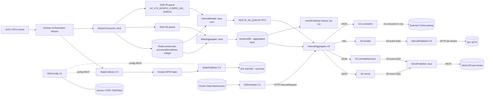

# WFM Integration Platform — System Architecture

## Architecture Overview

The NICE WFM Integration Platform is a polyglot, event-driven pipeline that bridges contact-center ACD/DFO systems with Workforce Management backends (Verint, IEX) and the WFM Interval Aggregation pipeline. It runs ~11 microservices on AWS ECS Fargate.

**The platform operates two independent pipelines:**

| Pipeline | Cadence | Path |
|----------|---------|------|
| **A. Real-time agent state** | Streaming (per-event) | Kinesis → Java aggregation → DynamoDB; parallel C# path → IEX ASCWS |
| **B. Historic interval files** | 15 / 30 min batch | DynamoDB → C# IntervalAggregator → S3 (per-WFM prefix) → SFTP/REST publishers |

The Verint, IEX-historic, and CxOne paths are **all file-based** (handed off via S3), one prefix per WFM target. Real-time agent state to IEX uses ASCWS REST over Kinesis — a completely separate path.

### Top-level data flow

### Entry points

| Source | Lands in | Path |
|--------|----------|------|
| ACD/DFO orchestration events | Kinesis Orchestration Stream | → StreamConsumer + StateCollector |
| Cluster DW ETL jobs | SQL Server (per cluster) | → polled by EtlScheduler |
| Admin REST calls | WfmConfig HTTPS endpoint | → Aurora/COR/MyGlobal |
| Internal HTTP from EtlScheduler | IntervalAggregator REST | `POST /api/v1/Interval/cluster` |
| S3 file events | SqsVerintPublishQueue / SqsPublishQueue | → VerintPublisher / IntervalPublisher |

### External dependencies

- **AWS managed**: Kinesis, SQS (standard + FIFO), DynamoDB, ElastiCache (Redis), Secrets Manager, CloudWatch, ECS Fargate, **S3 (interval files + TLS certs)**, RDS Aurora (MySQL)
- **External targets**: Verint WFM REST, IEX ASCWS REST (real-time), **IEX SFTP (historic intervals)**, external CxOne (historic)
- **Cluster Data Warehouses**: SQL Server, one per cluster, polled via `cluster_dw_vip`

---

## Core Components

### Java services (Spring Boot 3.5.9, Java 21)

| Service | Single-sentence responsibility |
|---------|-------------------------------|
| **StreamConsumer** | Read Kinesis orch records, write Redis sorted-set inflight keys, send SA + prefixed IR SQS notifications |
| **StateAggregator** | Consume SQS notifications, read events from Redis, aggregate by entity+time window, write DynamoDB facts |
| **IntervalReader** | Cron-driven Redis sorted-set reader; coordinates per-domain batches; outputs to FIFO SQS for aggregation |
| **VerintPublisher** | Consume S3 file events from `verint/` + `verintadherence/`, parse, POST to per-tenant Verint REST |

### C# services (ASP.NET Core, .NET 6+)

| Service | Single-sentence responsibility |
|---------|-------------------------------|
| **WfmConfig** | Central REST API for tenant/cluster/shard/adherence config across Aurora/COR/MyGlobal |
| **StateCollector** | Read orchestration Kinesis, transform to WFM-centric state events, publish to WFM State Kinesis |
| **StatePublisher** | Consume WFM State Kinesis, post real-time agent state to IEX ASCWS REST |
| **IntervalAggregator** | Read DynamoDB facts, run 3 report generators (CxOne/IEX/Verint), write S3 files (per-WFM prefix) |
| **IntervalPublisher** | Consume S3 file events from `iexsftp/`, SFTP-push to per-tenant IEX SFTP servers |
| **EtlScheduler** | Poll per-cluster DW every 60 s; HTTP-POST `IntervalRequest` to IntervalAggregator |

### Database module

| Module | Responsibility |
|--------|---------------|
| **integrations-wfm-database** | Aurora MySQL schema (tables + stored procedures) deployed via PowerShell `build.ps1` |

### Constraints / Invariants

- Every service is **multi-tenant**; events/records carry a `tenantId`
- Time math is **UTC** internally; standard interval = **15 min** (aligned to quarter-hour)
- Real-time pipeline writes to **DynamoDB**; historic-interval pipeline reads from **DynamoDB** and writes to **S3**
- S3 file-drop pattern uses S3 event notifications → SQS → publisher service
- TLS certs from S3 at startup for C# services

---

## Service Interactions

### Communication patterns

| Pattern | Where used |
|---------|-----------|
| **Kinesis pub/sub** | ACD/DFO → StreamConsumer + StateCollector; StateCollector → StatePublisher |
| **SQS point-to-point** | StreamConsumer → StateAggregator (SA queue) + IntervalReader (IR queue, prefixed) |
| **SQS FIFO** | IntervalReader → aggregation (IR_SA_QUEUE.fifo) |
| **S3 file drop + SQS event** | IntervalAggregator → VerintPublisher / IntervalPublisher |
| **Internal REST** | EtlScheduler → IntervalAggregator; all services → WfmConfig |
| **External REST** | StatePublisher → IEX ASCWS; VerintPublisher → Verint API |
| **External SFTP** | IntervalPublisher → IEX SFTP servers |
| **DB shared** | StateAggregator writes DynamoDB → IntervalAggregator + VerintPublisher (DynamoDB-rooted aggregation) read it |

### Auth / authorization

- **WfmConfig**: JWT Bearer (custom signature validation; relaxed in dev)
- **Internal HTTP**: VPC + security groups (no mTLS)
- **AWS APIs**: ECS task role `Role-integrations-ecs-service`
- **Verint REST per tenant**: per-tenant credentials returned by Aurora stored procedure `External_GetAllTenantData()`
- **IEX SFTP per tenant**: per-tenant credentials returned by Aurora stored procedure `Interval_GetSftpConnectionsByTenantStack` (underlying table `tbl_409_iex_config`)

### Error & retry policy

- Kinesis: KCL checkpoint replay
- SQS: visibility timeout + DLQ for poison messages
- HTTP / SFTP: services retry transient failures; metrics track persistent ones
- DB: EtlScheduler auto-reloads Secrets Manager credentials on auth errors

---

## Data Models

### Conceptual entities

| Entity | Owner | Storage |
|--------|-------|---------|
| Tenant config (status, divisions, external WFM creds, SFTP creds) | WfmConfig | Aurora (`tbl_409_*` tables + procedures) |
| Cluster + DW VIP definition | WfmConfig (CRUD), EtlScheduler (read) | Aurora |
| Raw orchestration event | StreamConsumer | Kinesis + Redis (sorted set) |
| Aggregated state fact | StateAggregator | DynamoDB |
| 15-min interval report (per WFM target) | IntervalAggregator | **S3 files** |

### Schema migration

Schema changes ship via `integrations-wfm-database` (`build.ps1` assembles `Tables/` → `StoredProcedures/` → `PostDeploy/`). All migrations idempotent. No ORM migration framework — direct Dapper raw-SQL.

### Caching strategy

- **Redis sorted sets** — per-domain inflight pointers (`ac:inflight`, `cs:inflight`, `acdfo:inflight`, `csdfo:inflight`, `as:inflight`)
- **In-memory** — config DTOs cached in each C# service after first WfmConfig fetch; VerintPublisher caches tenant config (invalidate via `CacheController`)

---

## Conventions & Patterns

### Naming

- Repos: `integrations-wfm-<role>` (kebab-case)
- Java packages: `com.nicewfm.<service>.<layer>`
- C# namespaces: `WfmEtlScheduler`, `WfmIntervalPublisher`, etc.
- Env vars: `NICEWFM_<AREA>_<NAME>` for Java; PascalCase for C# (`AuroraSecret`)
- Aurora stored procedures: `<Entity>_<Operation>` (e.g., `TenantStatus_Put`, `Interval_GetClusters`)
- S3 prefixes: per-WFM-target (`iexsftp/`, `cxonewfm/`, `verint/`, `verintadherence/`)

### Service layout

- **Java**: Spring Boot — `Application.java` + `controllers/` + `service/` + `sqs/` + `redis/`
- **C#**: `Program.cs` + `Startup.cs` + `Controllers/` + `DataAccess/` + `DTO/` + `Monitoring/`

### Testing

- Java: Maven + JaCoCo + SonarQube
- C#: `<Service>.XunitTests/` + Coverlet (runs in Dockerfile unit-test stage)

### Logging & observability

- Java: SLF4J + Logback + `logstash-logback-encoder` (JSON)
- C#: structured JSON to stdout → CloudWatch log group `integrations-wfm-<service>`
- C# services expose Prometheus `/metrics`

### Config

- All secrets in AWS Secrets Manager (`integrations-*`)
- All TLS certs in S3 (`ic-certs-do` dev, `ic-certs-so` staging)
- FIPS toggled via `ENABLE_FIPS` + `AWS_USE_FIPS_ENDPOINT`

---

## Common Tasks

### Onboard a new tenant

1. WfmConfig: `PUT /api/tenantInfo` and `PUT /api/tenantStatus`.
2. Aurora `tbl_409_iex_config` (if IEX or Verint): populate the relevant external-system columns (REST endpoints, ASCWS creds, SFTP host/credentials). VerintPublisher reads via `External_GetAllTenantData`; IntervalPublisher reads via `Interval_GetSftpConnectionsByTenantStack`.
4. Aurora `TenantStatus.IsEnabled = 1`.
5. EtlScheduler picks up new clusters via `Interval_GetClusters` on its next 60-second tick.

### Trace one event end-to-end

Pick a pipeline:
- **Real-time agent state** → see `wfm-execution-flow` Flow 1
- **Historic interval file → Verint/IEX/CxOne** → see `wfm-execution-flow` Flow 2

### Add a new WFM target (e.g., a fourth WFM vendor)

1. Add a new report generator in `IntervalAggregator/ExternalModels/<NewTarget>/`.
2. Add S3 prefix routing in `AwsS3Publisher`.
3. Add a new publisher service (mirror of `wfm-verintpublisher` or `wfm-intervalpublisher`).
4. Add S3-event SQS notification for the new prefix.
5. Update relevant skills + diagrams.

### Roll out a schema change

See `wfm-database` for the idempotent migration pattern.

---

## Troubleshooting

| Symptom | First check | Deep-dive skill |
|---------|-------------|-----------------|
| Real-time events missing in DynamoDB | StreamConsumer + StateAggregator | `wfm-stateaggregator`, `wfm-observability` |
| Verint not receiving data | S3 `verint/` files exist? SqsVerintPublishQueue depth? | `wfm-verintpublisher` |
| IEX SFTP empty for tenant | S3 `iexsftp/{Stack}/{Tenant}/` files? SqsPublishQueue depth? | `wfm-intervalpublisher` |
| IEX real-time state stale | StateCollector → Kinesis WFM State → StatePublisher | `wfm-statepublisher` |
| Interval files missing in S3 | DynamoDB rows present? IntervalAggregator HTTP entry triggered? | `wfm-aggregator`, `wfm-etlscheduler` |
| Config not propagating | WfmConfig health, Secrets Manager access | `wfm-config` |

---

## Reference Files

Read these first when onboarding:

- `README.md` (repo root)
- `boot/*-Service-task.json` — ECS task definitions per service
- `cicd/` — CloudFormation + Jenkins pipeline
- `pipeline.properties` — environment + region matrix
- `Jenkinsfile`

Per-service entry points:

- `integrations-wfm-streamconsumer/src/main/java/.../NiceWfmConsumerApplication.java`
- `integrations-wfm-stateaggregator/src/main/java/.../StateAggregatorApplication.java`
- `integrations-wfm-intervalreader/src/main/java/com/nicewfm/interval/reader/NiceWfmIntervalReaderApplication.java`
- `integrations-wfm-verintpublisher/src/main/java/com/nicewfm/IntegrationsWfmVerintpublisherApplication.java`
- `WfmConfig/Startup.cs`
- `integrations-wfm-statecollector/wfm-statecollector/StateCollector.cs`
- `integrations-wfm-statepublisher/Wfm-StatePublisher/`
- `integrations-wfm-aggregator/wfm-intervalaggregator/IntervalAggregator.cs`
- `integrations-wfm-intervalpublisher/WfmIntervalPublisher/IntervalPublisher.cs`
- `integrations-wfm-etlscheduler/WfmEtlScheduler/EtlScheduler.cs`

### Related skills

- `wfm-dependency-mapping` — exact inter-service contracts and resource ownership
- `wfm-execution-flow` — step-by-step event walkthroughs (both pipelines)
- `wfm-observability` — metrics, logs, alarms
- Module skills: `wfm-streamconsumer`, `wfm-stateaggregator`, `wfm-intervalreader`, `wfm-verintpublisher`, `wfm-config`, `wfm-statecollector`, `wfm-statepublisher`, `wfm-aggregator`, `wfm-intervalpublisher`, `wfm-etlscheduler`, `wfm-database`
